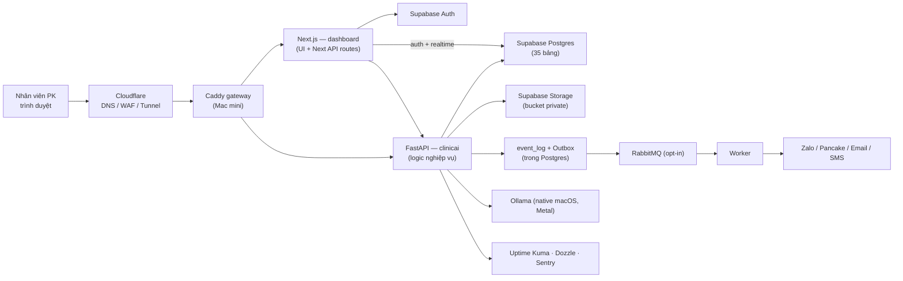
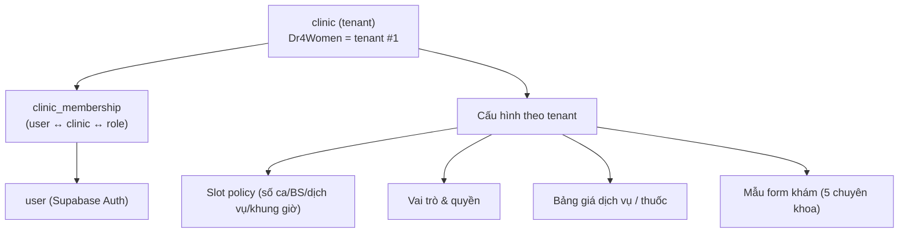
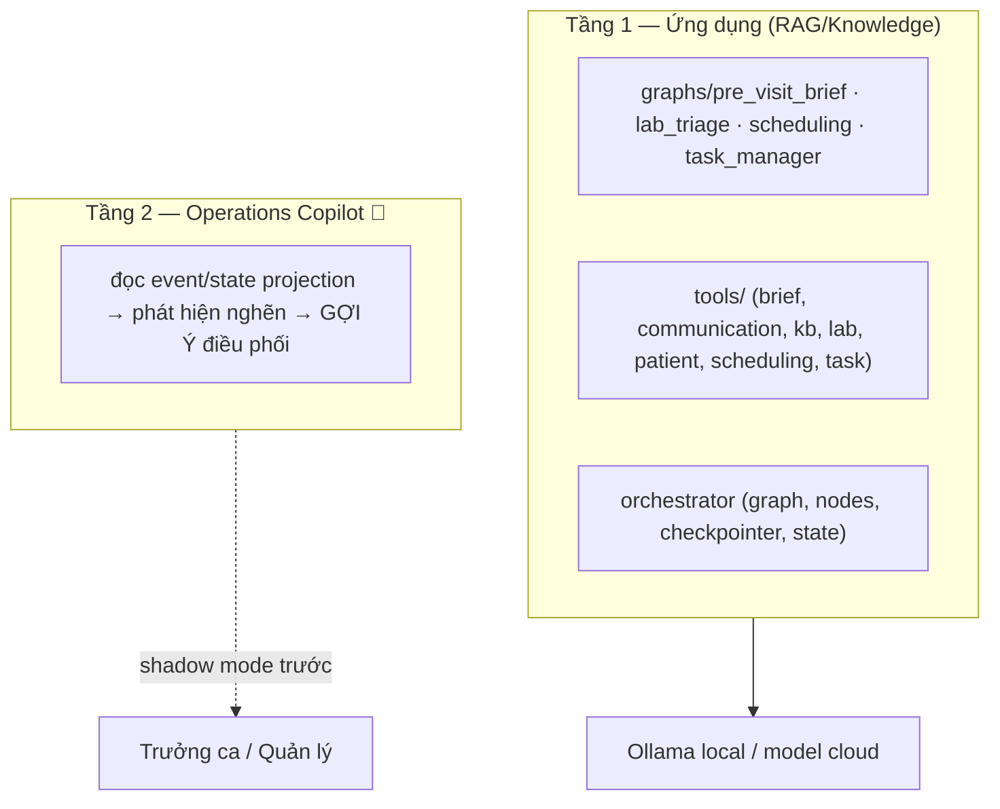

# 🩺 ClinicAI — Tài liệu tường minh toàn hệ thống

> **Mục đích:** một tài liệu duy nhất để hiểu ClinicAI *cùng nhau* trước khi code — đi từ **tổng quát → chi tiết**, đủ để cả người **low-code** cũng nắm được: hệ thống là gì, ai làm gì, màn hình ra sao, dữ liệu nào, work-item / event / route / trigger nào, backend phục vụ ai, điều phối chung thế nào.
>
> **Đích đến:** hoàn thiện hệ thống **ready-to-sell** (bán cho nhiều phòng khám), có **CI/CD** và **bảo mật** đúng chuẩn.
>
> **Nguồn tổng hợp:** codebase `Avalook/Clinic-AI-MacMini@main` (tier-1, đo trực tiếp 30/07/2026) + Notion ClinicAI (BRIEF 29/07, Đường lối kỹ thuật v1, Technical DOD, Flow v1, Nghiên cứu rủi ro 15). Khi mâu thuẫn: **code/migration thắng về kỹ thuật, Notion thắng về ý đồ nghiệp vụ**.
>
> **Quy ước trạng thái trong tài liệu:** ✅ *đang chạy (V1)* · 🟡 *có một phần / đang chuyển* · 🔵 *mục tiêu V2, chưa code*.

---

## 0. Đọc tài liệu này thế nào

| Bạn là | Đọc mục |
|---|---|
| Muốn hiểu nhanh "ClinicAI là gì" | §1, §2 |
| Product / low-code | §1 → §3 → §7 (vai trò) → §8 (luồng) |
| Dev backend | §2, §4, §5, §6, §10 |
| Dev frontend | §7, §8, §3 |
| Vận hành / bảo mật | §10, §11 |
| Lập kế hoạch hoàn thiện | §12 (gap + roadmap) |

Thuật ngữ khó tra ở **§13 — Từ điển**.

---

## 1. ClinicAI là gì (tổng quát nhất)

**ClinicAI là một nền tảng phần mềm quản lý phòng khám dạng multi-tenant** (một hệ thống, mở sẵn cho **nhiều phòng khám**). Phòng khám đầu tiên chạy thật là **Dr4Women** (phụ khoa – sản – nội tiết – hiếm muộn – nam khoa).

Điểm cốt lõi khác phần mềm phòng khám thường: **không có một nút "Khám" chung chung.** Mọi việc trong phòng khám được mô hình hoá thành **node (nút nghiệp vụ)** có:
- điều kiện bắt đầu (precondition / gate),
- công việc phải làm,
- điều kiện hoàn thành,
- và đường đi tiếp theo (routing).

Từ mỗi node, hệ thống sinh ra **Work Item** — một *đầu việc cụ thể* gắn với một bệnh nhân/lượt khám, giao cho đúng người. Nhờ vậy hệ thống luôn trả lời được 3 câu hỏi vận hành:

> **Ai cần làm gì tiếp? · Đang chờ gì? · Có gì quá hạn (SLA)?**

Nói cách khác, ClinicAI trước hết là một **lớp điều phối công việc (workflow orchestration)** cho toàn hành trình bệnh nhân:

```
Đặt lịch → Tiếp nhận/Check-in → Hàng đợi → Khám → Dịch vụ (SA/XN/thủ thuật)
        → Kết quả (bác sĩ duyệt) → Thanh toán → Đóng lượt → Theo dõi sau khám
```

**Nguyên tắc nền:** `staff_task` / Work Item **không** phải nơi chứa *sự thật lâm sàng*. Sự thật lâm sàng nằm ở các hồ sơ chuyên trách (`clinical_record`, `lab_result`, `ultrasound_record`, `prescription`…). Work Item chỉ *điều phối* việc.

### Tầm nhìn ready-to-sell
- **Luật nghiệp vụ là CẤU HÌNH, không viết cứng.** Đây là thứ quyết định có bán được cho phòng khám thứ 2 hay không: số slot theo bác sĩ/dịch vụ/khung giờ, vai trò/quyền, bảng giá, mẫu form khám… đều là dữ liệu cấu hình theo từng `clinic`.
- Có **AI hỗ trợ** (RAG trả lời có nguồn, tóm tắt hồ sơ, gợi ý điều phối) nhưng **AI không tự quyết định y khoa và không tự đổi trạng thái hồ sơ**.

---

## 2. Kiến trúc tổng thể

### 2.1 Kiểu kiến trúc
**Modular monolith, hướng sự kiện (event-driven).** Một codebase, một database transaction; chỉ tách service riêng khi *có số đo* chứng minh cần scale/deploy độc lập. (Không Kubernetes, không microservice, không Kafka, không multi-region trong v1 — *right-sized, not trendy*.)

### 2.2 Nơi chạy & nơi giữ dữ liệu
- **Compute (đang chạy):** Mac mini M4 Pro 48GB + **Docker Compose** + **Caddy** (ingress/TLS). *(Technical DOD ghi "Cloud VPS" — đó là mục tiêu Giai đoạn C; hiện thực tại là Mac mini.)*
- **Dữ liệu (nguồn sự thật):** **Supabase cloud** — Postgres (nghiệp vụ), Auth (đăng nhập/định danh), Storage private (ảnh/video/PDF kết quả).
- **Nguyên tắc sống còn:** *Mac mini là compute node, KHÔNG phải nơi giữ dữ liệu duy nhất.* Tắt/hỏng Mac không được làm mất bệnh án, trạng thái workflow, audit hay file. Muốn lên cloud chỉ cần **triển khai lại container**, không di chuyển nghiệp vụ.



### 2.3 Stack (đo từ code)
| Lớp | Công nghệ | Ghi chú |
|---|---|---|
| Frontend | **Next.js** (`src/dashboard`, ~160 file ts/tsx) | UI only. ⚠️ bản Next đã tuỳ biến (xem `src/dashboard/AGENTS.md`). |
| Backend | **FastAPI** (`src/clinicai`, ~224 file Python) | Toàn bộ logic nghiệp vụ + AI. |
| DB | **Supabase Postgres** — 35 bảng (migrations) | Schema quản lý bằng `supabase/migrations/*.sql`. Chi tiết: [`docs/database/ERD.md`](database/ERD.md). |
| Auth | Supabase Auth (JWT) + RLS | FastAPI verify JWT; `staff.auth_user_id` liên kết. |
| Queue/Event | **RabbitMQ** (opt-in) + Worker + `event_log`/Outbox trong PG | Nguồn sự thật workflow ở **Postgres**, không phải queue. |
| AI | **LangGraph** (graphs/tools/orchestrator) + Ollama local / model cloud | RAG bằng pgvector (mục tiêu). |
| Monitoring | Uptime Kuma, Dozzle, Sentry | Bind localhost, private qua Tailscale. |

### 2.4 Chuỗi vận hành chuẩn (trục event-driven)
Đây là "xương sống" mọi thao tác thay đổi trạng thái phải đi qua:

```
Command  →  Transaction (kiểm quyền + kiểm rule + ghi DB)  →  COMMIT
         →  Event + Outbox  →  Workflow  →  Routing  →  Work Item
                            ↘  Audit / Realtime / Thông báo / AI
```

**5 luật bất biến của trục này** (vi phạm là sai kiến trúc):
1. **Event chỉ phát SAU commit.** Rollback không được sinh notification/work-item giả.
2. **Ghi có side-effect phải idempotent.** Bấm nhiều lần = một hành động (nhờ `Idempotency-Key`).
3. **Rule kiểm ở backend.** Ẩn nút trên UI **không phải** phân quyền.
4. **Sổ cái (event_log/audit) append-only.** Sửa sai = ghi bản ghi đảo có lý do + người duyệt; không UPDATE/DELETE.
5. **Dual-write an toàn bằng Outbox** — ghi DB và phát event trong *cùng transaction* (ghi Outbox), worker đọc Outbox phát ra ngoài → không mất/không phantom event.

### 2.5 Thứ tự nguồn sự thật (khi tài liệu mâu thuẫn)
1. **Code, migration, schema đang chạy** ← luôn thắng về kỹ thuật
2. Quyết định đã duyệt / technical baseline
3. Tiêu chí khách hàng · báo cáo đã gửi khách (là *lời hứa*, không phải gợi ý)
4. Flow, prototype, research
5. Chat, comment chưa chốt

---

## 3. Multi-tenant — mở sẵn cho nhiều phòng khám

Mục tiêu bán được cho phòng khám thứ 2 → mọi thứ đặc thù Dr4Women phải là **cấu hình theo `clinic`**, không hardcode.



**Trạng thái: nền tảng đã dựng xong (W2, migration `20260730000003`).**

- **`clinic` + `clinic_membership` đã có trong schema.** Dr4Women là row tenant #1 với id cố định `a0000000-…-0001`, giống nhau ở mọi môi trường.
- **Định danh theo membership, không theo user** 🔵: một người có thể có vai trò khác nhau ở các cơ sở khác nhau → role gắn ở `clinic_membership`. Vì vậy `staff` **cố ý không** mang `clinic_id`: một bác sĩ làm ở 2 phòng khám là chuyện bình thường. *(V1 vẫn suy vai trò từ `staff.primary_department` — xem §7; cutover sang membership là W3.)*
- **27 bảng đã mang `clinic_id NOT NULL`** + FK + index. Không mang `clinic_id`: `province`/`ward` (danh mục quốc gia), `staff`/`staff_capability` (qua membership), `idempotency_key`/`schema_migrations` (hạ tầng).
- **Khoá duy nhất đã mang tenant**: mã bệnh nhân, mã dịch vụ, mã kênh đặt lịch, mã cơ sở, tên thuốc, CCCD, bảng giá, block budget — trước đây duy nhất *toàn cục*, nay duy nhất *trong một phòng khám*. Hai phòng khám dùng chung mã "BN001" không còn đụng nhau.
- **Helper cho RLS**: `current_staff_id()`, `current_clinic_ids()`, `current_clinic_roles(clinic_id)` — `STABLE SECURITY DEFINER`, suy tenant từ JWT chứ **không** nhận `clinic_id` do client gửi lên.
- **Nợ tạm thời có kiểm soát**: `clinic_id` đang có `DEFAULT default_clinic_id()` để code V1 (chưa biết tenant) chạy tiếp. Hàm này trả NULL ngay khi có phòng khám thứ 2 → gán nhầm sẽ *báo lỗi* chứ không âm thầm. W5 gỡ default.
- **Onboard phòng khám thứ 2** = tạo `clinic` + nạp cấu hình (slot policy, vai trò, giá, form) + tạo tài khoản nhân viên. Không sửa code.
- Bất biến được ép bằng test, không bằng lời hứa: `supabase/tests/multi_tenant_foundation.sql` chạy trong CI (job `database`), gồm cả kiểm chứng hành vi *nhân viên phòng khám A không đọc được phòng khám B*.

---

## 4. Mô hình Node & Work Item (trái tim của workflow)

### 4.1 Định nghĩa vs lần thực hiện 🟢 (đã có trong DB từ W4 — migration `20260730000005`)
| Thực thể | Ý nghĩa |
|---|---|
| `node_definition` | Định nghĩa nghiệp vụ dùng lại, ví dụ `KHAM-SANKHOA`, `DATLICH-01`. |
| `node_definition_version` | Phiên bản cấu hình của node tại thời điểm tạo lượt khám (đóng băng cấu hình). |
| `work_item` | Một đầu việc cụ thể của một bệnh nhân/lượt khám. |
| `work_item_dependency` | Phụ thuộc giữa hai Work Item cụ thể. |
| `work_item_event` | Lịch sử **bất biến** của mọi lần chuyển trạng thái. |
| `follow_up_case` | Việc theo dõi còn treo khi đóng lượt (có người phụ trách + hạn). |

> **Trạng thái W4:** 7 bảng kernel đã có trong schema, **37 node đã seed** từ §13, gate FS/SS/FF/SF + AND/OR/XOR chạy trong SQL (`work_item_gate_blockers`), Command API đã wire. **`staff_task` vẫn đang chạy phòng khám thật** và chưa migrate — đổi sang `work_item` phải đi cùng lúc với việc viết lại màn `/tasks` (đang đọc thẳng Supabase, chờ W5). Cũng **chưa có routing tự động**: chưa có gì tự sinh `work_item` khi check-in.

### 4.2 Dependency & Gate
`work_item_dependency`: `predecessor_work_item_id`, `successor_work_item_id`, `dependency_type` ∈ **FS/SS/FF/SF**, `is_blocking`, `gate_group`, `gate_operator` ∈ **AND/OR/XOR**, `condition_json`.
- **Blocking** = chặn bệnh nhân đi tiếp. **Non-blocking** = việc phụ, khi đóng lượt sẽ chuyển thành `follow_up_case` (không được biến mất).

### 4.3 State machine + Command API 🔵
Frontend **không** được `PATCH status=completed` tuỳ tiện. Nó gửi **lệnh nghiệp vụ**:

```
POST /api/v1/work-items/{id}/commands/start
POST /api/v1/work-items/{id}/commands/complete
POST /api/v1/work-items/{id}/commands/skip
POST /api/v1/work-items/{id}/commands/cancel
      (bắt buộc header Idempotency-Key)
```

Backend trong **một transaction** phải: (1) verify JWT + clinic + quyền → (2) load work item + `version` → (3) kiểm transition hợp lệ → (4) kiểm dependency/gate/dữ liệu bắt buộc → (5) update bằng **optimistic locking** (`version`) → (6) ghi `work_item_event` → (7) ghi `audit_log` → (8) ghi `outbox_event` nếu có side-effect → (9) **commit**. Gửi lại cùng `Idempotency-Key` → trả kết quả cũ, không làm lần hai.

### 4.4 Mẫu định nghĩa node chuẩn — **15 phần** (dùng khi tạo mọi node mới)
Đây chính là mức chi tiết để mô tả từng việc trong phòng khám:

1. Mục tiêu 2. Trigger 3. Actor (vai trò) 4. Input 5. Precondition/Gate 6. Công việc 7. Điều kiện hoàn thành 8. Output/Event 9. Routing 10. Alternative path 11. Corner case 12. Quyền override 13. UI state/prototype 14. API/Database 15. Test scenario (+ quyết định mở).

Có 5 **mẫu node** (template) để nhân bản: `TEMPLATE-FLOW-V1` (luồng nghiệp vụ), `TEMPLATE-CLINICAL-V1` (nút khám), `TEMPLATE-SERVICE-V1` (dịch vụ), `TEMPLATE-SERVICE-GROUP-V1` (nhóm dịch vụ), `TEMPLATE-NODE-V1` (chung).

---

## 5. Lõi hướng sự kiện (event-driven core)

### 5.1 Event schema (EVENT-02)
Mỗi event phải: **tên ở thì quá khứ** (`AppointmentCreated`, `ResultReviewed`, `PatientCheckedIn`…), `version`, `aggregate_id`, `correlation_id` (mã truy vết cả luồng), `actor`, `timestamp`.

### 5.2 Hạ tầng đang có ✅
- `event_log` (append-only, có cờ `event_published`) — sổ sự kiện trong Postgres.
- `src/clinicai/event_bus/` — `publisher.py`, `consumer.py`, `topics.py`, `adapters/`.
- **Topics (RabbitMQ routing keys):** `interaction.zalo`, `interaction.pancake`, `interaction.walkin`, `lab.result`, `appointment.created`, `appointment.cancelled`, `system.test`.
- `worker.py` + `notification_relay.py` — tiêu thụ event, gửi thông báo.
- `idempotency_key` (bảng có; endpoint chưa dùng đầy đủ 🟡).

### 5.3 Outbox + follow-up
- **Outbox**: ghi DB và ý định phát event trong cùng transaction; worker đọc và phát ra ngoài (đảm bảo tin cậy tuyệt đối).
- **follow_up_case** 🔵: khi đóng lượt mà còn work-item không chặn → tạo case theo dõi có người phụ trách + hạn.

---

## 6. Mô hình dữ liệu

**Hiện trạng:** 35 bảng theo migrations (+3 bảng "retired" còn sót ở prod, +`idempotency_key` chưa lên prod). Sơ đồ ERD đầy đủ: **[`docs/database/ERD.md`](database/ERD.md)**.

Nhóm theo domain (V1 đang chạy):

| Domain | Bảng chính |
|---|---|
| Bệnh nhân & Định danh (MPI) | `patient`, `patient_medical_profile`, `mpi_merge_queue`, `pregnancy` |
| Lịch hẹn – Lượt khám – Hàng đợi | `appointment`, `visit`, `care_episode`, `work_session`, `work_roster`, `work_session_staff`, `block_budget` |
| Lâm sàng | `clinical_record`, `clinical_form_response`, `lab_result`, `ultrasound_record`, `prescription`, `service_log` |
| Nhân sự & Cơ sở | `staff`, `staff_capability`, `staff_task`, `clinic_location` |
| Thanh toán & CSKH | `payment`, `cskh_log`, `cskh_action` |
| Danh mục | `service_type`, `service_price`, `drug_catalog`, `booking_channel`, `province`, `ward` |
| Hệ thống | `event_log`, `idempotency_key`, `schema_migrations` |

**Thực thể mục tiêu V2 (chưa có trong DB)** 🔵: workflow kernel (`node_definition(_version)`, `work_item(_dependency/_event)`, `follow_up_case`, `outbox_events`, `audit_logs`), thanh toán nội bộ (`billable_item`, `payment_transaction`, `payment_allocation`, `cashier_shift`), kho (`drug_batch`, `stock_movement`, `dispense_record`, `stock_policy`), RAG (`knowledge_documents/_versions`, `knowledge_chunks`, `knowledge_embeddings`, `retrieval_logs`, `answer_evaluations`), cấu hình slot (`slot_capacity_rule`), release-state cho kết quả.

---

## 7. Vai trò & màn hình — CHI TIẾT theo từng người

### 7.1 Bản đồ vai trò
**7 vai trò nghiệp vụ chính thức** (Technical DOD) được cụ thể hoá thành **11 mã phòng ban** trong code (`staff.primary_department` = `ClinicRole` trong `src/dashboard/lib/roles.ts`):

| Mã (department/role) | Nhãn | Vai trò nghiệp vụ |
|---|---|---|
| `DOCTOR` | Bác sĩ | Bác sĩ |
| `ULTRASOUND_DOCTOR` | Bác sĩ Siêu âm | Bác sĩ |
| `TKYK` | Thư ký Y khoa | Thư ký y khoa |
| `NURSE_ULTRASOUND` | Điều dưỡng / Phụ siêu âm | Điều dưỡng |
| `CSKH` | CSKH | CSKH |
| `RECEPTION` | Lễ tân | Lễ tân |
| `CASHIER` / `CASHIER_THUOC` / `CASHIER_DV` | Thu ngân / …thuốc / …dịch vụ | Thu ngân |
| `TRUONG_CA` | Trưởng ca | Trưởng ca |
| `MANAGEMENT` | Quản lý | Quản lý hệ thống |

**Quy tắc phân quyền cốt lõi (thuần, ở `lib/roles.ts` — mục tiêu là dời hẳn kiểm tra sang backend, ROLE-01):**
- `canWriteClinical` = **Bác sĩ + Điều dưỡng + TKYK** (ghi lý do khám, sinh hiệu, bệnh án, KQ xét nghiệm, log SA). Lễ tân/Quản lý **không** ghi lâm sàng.
- `canWriteIntake` (tạo BN/lịch) = CSKH, Lễ tân, Quản lý, Trưởng ca. *(Điều dưỡng đã bỏ khỏi intake.)*
- `canCheckin` = Lễ tân, Quản lý.
- `canManageAppt` (huỷ lịch + phân lại BS) = CSKH, Quản lý, Trưởng ca.
- `canEditPatient` (sửa hành chính, không đụng CCCD/định danh) = nhóm intake + Bác sĩ.
- `isCashierRole` = CASHIER / CASHIER_THUOC / CASHIER_DV.
- **`departmentToRole` không bao giờ tin role client gửi lên** — luôn suy từ `staff` server-side.

**Ma trận màn hình → vai trò được thấy** (`NAV_ROLES` trong `lib/roles.ts`):

| Route (màn hình) | Vai trò thấy được |
|---|---|
| `/home` | mặc định (mọi vai) |
| `/cskh-today` | CSKH, Quản lý, Trưởng ca |
| `/customers` | CSKH, Lễ tân, Quản lý, Thu ngân×3, Trưởng ca |
| `/appointments` | Quản lý, Trưởng ca |
| `/schedule` | **tất cả** (tự đăng ký ca → chờ duyệt) |
| `/queue` | CSKH, Quản lý, Lễ tân, Trưởng ca, TKYK, Điều dưỡng, Bác sĩ |
| `/tasks` ("Công việc của tôi") | gần như tất cả (Bác sĩ, TKYK, ĐD, CSKH, Lễ tân, Thu ngân, Quản lý) |
| `/patient-list` | tất cả (mở hồ sơ vẫn bị guard ở `/patients/[id]`) |
| `/patients/new` | CSKH, Lễ tân, Quản lý, Trưởng ca |
| `/lab-queue`, `/service-queue`, `/sono` | Điều dưỡng/Phụ SA, Quản lý |
| `/episodes` | CSKH, Quản lý, Trưởng ca |
| `/cashier/thuoc` | CASHIER_THUOC, CASHIER, Quản lý, Trưởng ca |
| `/cashier/dich-vu` | CASHIER_DV, CASHIER, Quản lý, Trưởng ca |
| `/truong-ca` | Trưởng ca, Quản lý |
| `/work-sessions`, `/reports` | Quản lý, Trưởng ca |
| `/ops`, `/settings` | **chỉ Quản lý** |

---

### 7.2 CSKH (Chăm sóc khách hàng)
- **Làm gì:** nhắn tin/gọi điện với bệnh nhân (Zalo/Pancake/điện thoại), **đặt/đổi/huỷ lịch**, nhắc hẹn, theo dõi sau khám, và **gửi kết quả cho bệnh nhân sau khi bác sĩ cho phép**.
- **Màn hình:** `/cskh-today` (việc CSKH hôm nay), `/customers` (hồ sơ khách hàng gộp hội thoại), `/appointments`/`/episodes` (đặt & đóng đợt để hẹn lần sau), `/queue` (theo dõi), `/tasks`.
- **Dữ liệu chạm:** `cskh_log`, `cskh_action`, `patient` + `patient_contact_channel`, `appointment`, `care_episode`, `payment` (xem).
- **Work-item / Event / Route / Trigger:**
  - Event vào: `interaction.zalo` / `interaction.pancake` / `interaction.walkin` → gom hội thoại về đúng **Customer Profile** (CX-01). Nếu chưa chắc danh tính → **không tự gộp**, đẩy vào hàng chờ "Xác nhận ghép hồ sơ" (`mpi_merge_queue`).
  - CX-02: mọi tin nhắn khách phải có **người chịu trách nhiệm + SLA** (không bỏ sót).
  - Đặt lịch: command → kiểm capacity/slot policy → `AppointmentCreated`; huỷ/đổi → **giải phóng slot** thành trống (`appointment.cancelled`).
  - Gửi kết quả: chỉ khi trạng thái = `release_now` (NOTIFY-01 chặn mọi kênh khi chưa duyệt).
- **Backend phục vụ:** `notification_relay.py` + `notification_templates.py`, `mpi_service.py` (gộp hồ sơ), `scheduling_service.py`, `patient_context_service.py`, LangGraph `graphs/pre_visit_brief` + `tools/communication`.
- **Ranh giới:** CSKH **không** ghi lâm sàng, **không** tự phát hành kết quả.

### 7.3 Lễ tân (RECEPTION)
- **Làm gì:** xem/sửa **thông tin hành chính** bệnh nhân, **check-in**, đưa bệnh nhân vào **hàng chờ**, bàn giao sang thanh toán. Menu cố tình **gọn** (Trang chủ + Nhập khách + Check-in).
- **Màn hình:** `/home` (check-in ngay trên trang chủ), `/patients/new`, `/patient-list`, `/customers`, `/queue` (chỉ xem/điều phối cơ bản), `/tasks`.
- **Dữ liệu chạm:** `patient`, `appointment` (check-in), `visit` (tạo lượt khám), `care_episode`.
- **Work-item / Event:** `VISIT-01` check-in **không** tạo 2 lượt khám (idempotent; walk-in có định danh riêng + dedup) → event `PatientCheckedIn` → routing xác định dịch vụ/ưu tiên → tạo work-item cho điều dưỡng/phòng khám.
- **Backend:** `patient_service.py`, `scheduling_service.py`, `queue_order.py`.
- **Ranh giới:** **không** ký/phát hành kết quả lâm sàng.

### 7.4 Bác sĩ (DOCTOR) & Bác sĩ Siêu âm (ULTRASOUND_DOCTOR)
- **Làm gì:** khám **5 chuyên khoa** (`KHAM-PHUKHOA`, `KHAM-SANKHOA`, `KHAM-NOITIET`, `KHAM-HIEMMUON-VOSINH`, `KHAM-NAMKHOA`), tạo **chỉ định** (SA/XN/thủ thuật/thuốc), **duyệt & quyết định phát hành kết quả**, **ký** bệnh án.
- **Màn hình:** `/tasks` ("Công việc của tôi" = DoctorWorkBoard), `/queue`, `/schedule` (tự đăng ký ca), `/patient-list` → `/patients/[id]` (guard: chỉ mở BN của mình). Bác sĩ SA dùng `/sono`.
- **Khu làm việc bác sĩ:** cùng một khung; đổi phần/trường bắt buộc/kiểm tra hợp lệ theo **cấu trúc biểu mẫu** của chuyên khoa (`src/dashboard/lib/form-schemas/{pk,sk,nt,hmvs,nk}.ts`).
- **Dữ liệu chạm:** `clinical_record`, `clinical_form_response`, `ultrasound_record`, `lab_result` (duyệt), `prescription`, `service_log`.
- **Work-item / Event / State machine kết quả (§8.2 DOD):**
  - `EncounterStarted` → khám → `ClinicalRecordSigned` (chỉ bác sĩ ký; sửa sau ký = **version mới + lý do**, CLIN).
  - Kết quả: `uploaded → waiting_doctor_review →` bác sĩ chọn **`release_now`** hoặc **`sensitive_hold`**.
    - `release_now` → tạo work-item cho CSKH gửi (`exported → sent → delivered/delivery_failed`).
    - `sensitive_hold` 🔵 = **chặn cứng ở backend, KHÔNG tự hết hạn**; chỉ quyết định mới của bác sĩ mới mở (RESULT-01/02/03). *Đây là "release_state" đang thiếu (BRIEF W3).*
- **Backend:** `patient_context_service.py` (brief hồ sơ), `graphs/lab_triage`, `tools/lab`, `tools/brief`.
- **Ghi chú:** `TKYK` (Thư ký y khoa) được xếp cùng nhóm "doctor-scope" cho lịch hẹn, và **được ghi lâm sàng dạng nháp** — nhưng **chỉ bác sĩ ký**.

### 7.5 Điều dưỡng / Phụ siêu âm (NURSE_ULTRASOUND)
- **Làm gì:** **sinh hiệu**, lấy mẫu, thủ thuật, DXA, cấp thuốc (thao tác), phụ siêu âm; quản 3 hàng đợi dịch vụ.
- **Màn hình:** `/lab-queue` (xét nghiệm), `/service-queue` (dịch vụ), `/sono` (siêu âm), `/tasks`, `/patient-list` (tra cứu).
- **Dữ liệu chạm:** `service_log`, `lab_result` (nhập), `ultrasound_record` (số đo), sinh hiệu gắn `visit` (`VITAL-01`: người đo, thời điểm, đơn vị, giá trị; ngưỡng bất thường → cảnh báo, **không tự chẩn đoán**).
- **Ranh giới:** ghi lâm sàng ✅ (`canWriteClinical`) nhưng **không** tạo BN/không check-in (đó là việc Lễ tân).

### 7.6 Thu ngân (CASHIER / CASHIER_THUOC / CASHIER_DV)
- **Làm gì:** đối soát, **thu tiền**, đóng lượt. Bảng giá tách 2 màn: **thuốc** và **dịch vụ**; mỗi vai tách chỉ thấy màn của mình, `CASHIER` là superset.
- **Màn hình:** `/cashier/thuoc`, `/cashier/dich-vu`, `/customers` (read-only), `/tasks`.
- **Dữ liệu chạm:** `payment`, `service_price`, `drug_catalog`, `service_log`.
- **Nguyên tắc:** **chỉ dịch vụ ĐÃ THỰC HIỆN mới sinh khoản phải thu** (chỉ định chưa làm không tính tiền).
- **⚠️ Điểm tiến hoá quan trọng:** Technical DOD §9 (bản cũ) mô tả **bàn giao thanh toán sang KiotViet** (PAY-01/02/03). **Quyết định mới (29/07, đã xác nhận): ClinicAI tự ôm payment + inventory** → DOD §9 đã bị thay. Mục tiêu V2 (BRIEF W5): ledger nội bộ `billable_item` + `payment_transaction` (append-only) + `payment_allocation` + `cashier_shift`; hỗ trợ thu nhiều đợt / thu một phần / hoàn tiền; lệch đối soát chưa giải trình thì **không đóng ca được**.
- **Backend:** `payment_service.py`.

### 7.7 Trưởng ca (TRUONG_CA)
- **Làm gì:** xem **toàn cảnh hàng đợi**, xử lý nghẽn, **duyệt/từ chối** đề xuất điều phối, xử lý phát sinh vận hành (sửa lịch, BN, bảng giá, trực, báo cáo). Lâm sàng thì **chỉ xem**, không đổi kết luận bác sĩ.
- **Màn hình:** `/truong-ca`, `/queue`, `/appointments`, `/work-sessions`, `/reports`, `/cskh-today`.
- **Work-item / Event:** event từ các node → **operational projection** → phát hiện **quá SLA/nghẽn** → cảnh báo/recommendation → Trưởng ca xử lý. `OPS-02`: mọi điều phối (chuyển BN/work-item) phải có **source, destination, reason, actor, timestamp**. `QUEUE-02`: chen hàng/override cần quyền + reason code + hiển thị cho Trưởng ca.
- **Backend:** `ops_status.py` (projection), `queue_order.py`.
- **Ranh giới:** quyền hành chính rộng nhưng **thấp hơn Quản lý** — không vào `/settings`.

### 7.8 Quản lý hệ thống (MANAGEMENT)
- **Làm gì:** quản lý tài khoản, vai trò; **cấu hình slot đặt lịch** (theo bác sĩ/dịch vụ/khung giờ); cấu hình tham số theo quy mô phòng khám mình; xem báo cáo & ops.
- **Màn hình:** `/settings` (+`/settings/new-user`), `/ops`, `/reports`, `/work-sessions`, và xem được hầu hết màn khác.
- **Dữ liệu chạm:** `staff`, `staff_capability`, `work_roster`, `work_session`, `service_price`, `block_budget`, (mục tiêu) `slot_capacity_rule`.
- **Ranh giới (ROLE-02):** **không mặc định** đọc/sửa hồ sơ lâm sàng — phải được cấp riêng. *(BRIEF cảnh báo RLS hiện quá rộng: nhiều vai đọc được lâm sàng — cần siết, xem §10 + §12.)*
- **Backend:** `staff_service.py`, `scheduling_service.py`, `ops_status.py`.

---

## 8. Luồng nghiệp vụ đầu–cuối

### 8.1 Sơ đồ luồng chính

```mermaid
flowchart LR
  A["Đặt lịch<br/>DATLICH-01..04<br/>(CSKH)"] --> B["Check-in<br/>(Lễ tân)"]
  B --> Q["Hàng đợi / Bảng điều phối<br/>(Trưởng ca)"]
  Q --> V["Sinh hiệu<br/>(Điều dưỡng)"]
  V --> K["Khám 5 chuyên khoa<br/>LUOTKHAM<br/>(Bác sĩ)"]
  K --> O["Chỉ định dịch vụ"]
  O --> S["Siêu âm (15 loại) / Xét nghiệm / Thủ thuật<br/>(ĐD / BS SA)"]
  S --> R["Kết quả → bác sĩ duyệt<br/>release_now | sensitive_hold"]
  R --> P["Thanh toán<br/>(Thu ngân)"]
  P --> C["Đóng lượt<br/>(Thu ngân / CSKH)"]
  C --> F["Theo dõi sau khám<br/>follow_up_case (CSKH)"]
```


### 8.2 Ràng buộc quan trọng trên luồng (từ Technical DOD)
- **QUEUE-01:** mỗi bệnh nhân **chỉ ở một node hoạt động** tại một thời điểm; chuyển node có source/lý do/người/thời điểm.
- **QUEUE-03:** màn hình TV gọi số **không lộ dữ liệu nhạy cảm** (chỉ mã gọi/tên rút gọn; không chẩn đoán/SĐT/kết quả).
- **SERVICE-01:** kết quả gắn đúng chỉ định (bắt buộc order ID + encounter ID; **không** gắn file bằng tên BN tự do).
- **SERVICE-02:** kết quả `draft/pending_review` **bị chặn** phát hành ở backend.
- **BOOK-02 (ưu tiên slot policy):** ngày đặc biệt → bác sĩ+dịch vụ+khung giờ → bác sĩ+khung giờ → mặc định cơ sở.

### 8.3 Ví dụ luật slot (Dr4Women) — vì sao phải là CẤU HÌNH
BS Thành 18:00–18:15 = **10 ca (8 thường + 2 ưu tiên)**, sau 18:15 = 4 (3+1). Bác khác: 18:00→3, 18:15→4, 18:30→5, từ 18:45→3.
→ Slot **không được hardcode**; phải đọc từ bảng `slot_capacity_rule(location_id, doctor_id, service_type_id, weekday, specific_date, minute_start, minute_end, cap_normal, cap_priority, effective_from, effective_to)`. Không khớp rule nào → từ chối rõ ràng `SLOT_POLICY_MISSING` (không im lặng cho qua). *(BRIEF W2.)*

---

## 9. AI hai tầng (có kiểm soát)



- **Tầng 1 (đang có ✅):** RAG trả lời **có nguồn**, tóm tắt hồ sơ (brief), gợi ý node/biểu mẫu, phân loại lab. Guardrail: AI1-01 grounded + test prompt-injection; AI1-02 **AI không tự xác nhận lịch** (chỉ tạo draft có schema, command vẫn kiểm quyền/capacity); AI1-03 brief không thay hồ sơ gốc (mọi câu quan trọng truy về nguồn); AI1-04 đo chi phí AI theo tenant/capability.
- **Tầng 2 (mục tiêu 🔵):** hiểu vận hành toàn phòng khám, phát hiện nghẽn, **đề xuất** điều phối hỗ trợ Trưởng ca — chạy **shadow mode** trước khi hỗ trợ quyết định thật.
- **Luật vàng:** AI **không** tự hoàn thành work-item, không tự quyết định y khoa, không tự duyệt kết quả, không tự bỏ gate, không sửa audit. Chỉ tạo **draft**.

---

## 10. Bảo mật & phân quyền

- **JWT + RLS + service_role.** FastAPI verify JWT; `staff.auth_user_id` liên kết Auth ↔ nhân viên. `public.current_staff_department()` (SECURITY DEFINER) ánh xạ `auth.uid()` → `staff.primary_department`.
- **Mô hình ghi:** **0 policy INSERT/UPDATE/DELETE** — đây là phần **đúng, giữ nguyên**; mọi ghi đi qua backend bằng `service_role`. Đọc thì có RLS.
- **🟢 Đã siết theo tenant (W3, migration `20260730000004`).** Trước đây **26 policy `FOR SELECT ... USING (true)`**: bất kỳ ai cầm anon key + một JWT hợp lệ là đọc được toàn bộ bệnh án/xét nghiệm/đơn thuốc/thai kỳ/thanh toán qua PostgREST. Nay điều kiện là `clinic_id IN (SELECT current_clinic_ids())` — đọc được một dòng khi và chỉ khi bạn là thành viên đang hoạt động của phòng khám sở hữu dòng đó. `staff` lọc theo `clinic_membership`; `event_log` giữ MANAGEMENT **và** thêm ràng buộc tenant; `province`/`ward` cố ý giữ mở (danh mục hành chính, không PII).
- **Áp có phanh:** migration tự huỷ (`RAISE EXCEPTION`) nếu còn nhân viên đang làm mà chưa có `auth_user_id` hoặc chưa có membership — không thể áp nửa chừng rồi khoá cả phòng khám ra ngoài. Trigger `staff_ensure_default_membership` giữ bất biến cho nhân viên mới, bất kể tạo bằng đường nào.
- **🔴→🟢 `idempotency_key`:** là bảng **duy nhất tắt hẳn RLS** trong `public`, mà nó lưu request/response đã replay (kèm payload bệnh nhân); Supabase mặc định cấp SELECT cho `authenticated` ⇒ ai đăng nhập cũng đọc được. Đã bật RLS + không policy + `REVOKE` khỏi `anon`/`authenticated`.
- **Tài khoản dùng chung** (`CLINIC_SHARED_EMAIL`, màn `/enter`) nay đọc **0 dòng** ở mọi bảng vì không có dòng `staff`. Cổng vẫn còn để mở được trang `/login` — bỏ hẳn là quyết định vận hành, xem §14.
- **⚠️ Còn lại — siết theo vai trò (W5, đích ROLE-02):** trong cùng một phòng khám, Lễ tân/Thu ngân vẫn đọc được `clinical_record`. Chưa siết được vì `/tasks` đọc `lab_result` + `prescription`, `/home` đọc `clinical_record` + `payment` **bằng chính session người dùng**, từ các màn mà những vai trò đó được phép vào. Phải dời các lệnh đọc đó ra sau FastAPI (§ ADR-0012) rồi mới siết, không thì chỉ làm trắng màn hình.
- **✅ `care_episode`** đã có policy (W1) — màn `/episodes` hết rỗng.
- **Audit append-only (AUDIT-01):** `event_log` không sửa/xoá; tra được theo patient/encounter/actor/action/time.
- **File y tế:** bucket **private** (`clinical-documents`, `ultrasound-media`, `lab-results`, `knowledge-source`); tải bằng JWT hoặc **signed URL ngắn hạn**; không public URL; giới hạn MIME + kích thước.
- **SEC:** TLS ở public endpoint; secret trong secret manager/env (không trong code — chỉ `.env.prod`/`.env.staging` + GitHub secrets); **không log** token/SĐT/nội dung bệnh án/signed URL (SEC-02); rate limit + bảo vệ đăng nhập (SEC-03).

---

## 11. CI/CD & vận hành

- **Môi trường:** `local` (dữ liệu giả) · `staging` (Mac mini + Supabase staging, dữ liệu ẩn danh) · `production` (Supabase production). `main → prod`, `staging → staging`; chạy song song trên Mac (khác project name + cổng Caddy).
- **Pipeline (đang có ✅):** CI mỗi PR/push (ruff/mypy/pytest + tsc/lint/build). CD tự deploy khi merge: **build → up → health → rollback** nếu lỗi. Deploy gắn theo SHA.
- **Observability 3 tầng (không trộn):** application log (Loki/Sentry/**Dozzle**) · metrics (Prometheus/Grafana) · **audit log** (append-only trong Supabase). Health: `/health/live`, `/health/ready`, `/health/dependencies`. Uptime monitor (**Uptime Kuma**) đặt ngoài/độc lập.
- **Backup & khôi phục:** Supabase Pro + auto backup; **logical dump** định kỳ (mã hoá, lưu ngoài — dự kiến Cloudflare R2); **Storage backup riêng** (Supabase backup KHÔNG gồm file, chỉ metadata → mirror bucket bằng `rclone`). **Restore thử hằng tháng.** Mục tiêu: booking/queue RTO ≤ 2h, RPO ≤ 15 phút; **chưa đưa dữ liệu bệnh nhân thật vào pilot trước khi có 1 lần restore thành công.**

---

## 12. Hiện trạng vs Mục tiêu (GAP) + Roadmap ready-to-sell

### 12.0 Quyết định đã chốt (2026-07-30) 🔒
Định hướng chung: **xây thẳng sản phẩm cuối từ bây giờ, không pilot-rồi-nâng-cấp.**

| # | Quyết định | ADR |
|---|---|---|
| 1 | Chạy Mac mini (chưa thuê VPS) nhưng **bê lên VPS không sửa code** — kiểm chứng bằng CI build/chạy amd64 | [0013](adr/0013-chay-mac-mini-san-sang-len-vps.md) |
| 2 | KiotViet: **mở sẵn cổng tích hợp** (port + adapter, mặc định tắt); ClinicAI vẫn là nguồn sự thật của payment + kho | [0010](adr/0010-kiotviet-cong-tich-hop-mo.md) |
| 3 | **Multi-tenant thật ngay**: `clinic`, `clinic_membership`, `clinic_id` mọi bảng nghiệp vụ, RLS theo tenant | [0009](adr/0009-multi-tenant-thuc-tu-dau.md) |
| 4 | **1 login/nhân viên từ giờ**, bỏ role-picker (`staff.auth_user_id` đã có sẵn trong schema, cần backfill + cutover) | [0004](adr/0004-auth-two-layer-fail-closed.md) → Accepted |
| 5 | **Dựng kernel workflow V2 ngay** (`node_definition`/`work_item`), seed 37 node ở §13, migrate rồi bỏ `staff_task` | [0011](adr/0011-kernel-workflow-v2-dung-ngay.md) |
| 6 | Ký số EMR + CCCD nằm trong scope ready-to-sell 31/12/2026 *(giả định theo "dựng hết" — xác nhận lại khi tới việc)* | §14 |
| 7 | **Siết RLS**, không giữ `USING (true)`; W1/W1b chỉ là vá tạm cho hết màn trắng | [0004](adr/0004-auth-two-layer-fail-closed.md) + [0009](adr/0009-multi-tenant-thuc-tu-dau.md) |
| 8 | 7 vai trò nghiệp vụ / 11 mã phòng ban — **đúng thực tế**, giữ nguyên | §7 |
| ⭐ | **Backend sở hữu hợp đồng**: đổi/vứt frontend không được ảnh hưởng hay làm hỏng backend | [0012](adr/0012-hop-dong-backend-frontend-thay-duoc.md) |

### 12.1 Đang chạy (V1) ✅
- Next.js dashboard đầy đủ màn theo 11 vai trò + phân quyền `lib/roles.ts`.
- FastAPI đã wire **14 router** (`health, identity, queue, patients, staff, scheduling, payment, tools, orchestrator, brief, catalog, ops, lab, voice` — `src/clinicai/main.py:98-111`) + service nghiệp vụ (Phase 4).
- Event bus (RabbitMQ + `event_log`/worker), MPI dedup, AI tầng 1 (LangGraph graphs/tools).
- 35 bảng, chống trùng slot (advisory lock, đã test đua), CI/CD có rollback, monitoring.

### 12.2 Khoảng cách tới V2 / ready-to-sell
| Hạng mục | Trạng thái | Việc |
|---|---|---|
| Vá RLS `care_episode` | 🟢 xong (chưa push) | Migration `20260730000001` — đã kiểm trên Postgres 17 dùng một lần (W1) |
| Vá RLS bảng tham chiếu | 🟢 xong (chưa push) | Cùng lỗi: 8 bảng bật RLS mà **0 policy**. `/reports` đọc `booking_channel` bằng session người dùng ⇒ luôn rỗng. Migration `20260730000002` mở SELECT cho `booking_channel`/`province`/`ward`; cố ý **không** mở `ultrasound_record`, `mpi_merge_queue`, `block_budget`, `staff_capability` (W1b) |
| Multi-tenant thật (`clinic_id`) | 🟢 xong (chưa push) | `clinic` + `clinic_membership` + `clinic_id` trên 27 bảng + khoá duy nhất mang tenant + helper RLS. Migration `20260730000003`, test `supabase/tests/multi_tenant_foundation.sql` chạy trong CI (W2) |
| Siết RLS theo tenant | 🟢 xong (chưa push) | 26 policy `USING (true)` → `current_clinic_ids()`; `idempotency_key` bật RLS; role-picker xoá hẳn; migration có precondition chặn nếu còn staff chưa link. Migration `20260730000004`, test `supabase/tests/tenant_scoped_rls.sql` (W3) |
| 1 login/nhân viên | 🟡 code xong, chờ vận hành | Luồng đã đúng (`getCurrentStaff` suy từ `auth.uid()`), UI cấp tài khoản đã có ở `/settings/new-user`. Còn: cấp tài khoản cho từng nhân viên chưa link, rồi quyết định bỏ cổng `/enter` dùng chung |
| Siết RLS theo **vai trò** | 🔴 chưa | Lễ tân/Thu ngân vẫn đọc được `clinical_record` trong cùng phòng khám; phải dời đọc ra sau FastAPI trước (W5, đích ROLE-02) |
| Workflow kernel | 🟢 xong (chưa push) | 7 bảng + gate SQL + Command API + **37 node đã seed**. Migration `20260730000005`/`20260730000006`, test `supabase/tests/workflow_kernel.sql` (W4) |
| Sinh work item tự động + bỏ `staff_task` | 🔴 chưa | Chưa có gì tự tạo `work_item` khi check-in; `staff_task` vẫn chạy thật. Cần chốt "một lượt khám sinh ra node nào" + viết lại màn `/tasks` (sau W5) |
| Backend sở hữu hợp đồng | 🟡 đợt 1 xong | Gỡ service-role khỏi 3 chỗ (`wards`, `check-phone`, `patients/new`); hàng rào CI `service-role-boundary.test.mts` với danh sách trắng **chỉ được ngắn đi**, trần 19 file → đích 2; `care_episode` đã dời trọn sang FastAPI làm mẫu (`PATCH /api/v1/episodes/{id}`, cờ `EPISODE_VIA_BACKEND`). Còn 14 route nghiệp vụ (W5) |
| Sẵn sàng lên VPS | 🟢 xong | Job CI `portability`: chặn đường dẫn `/Users/…`, build 2 image `linux/amd64`, chạy thật + smoke `/health` & `/health/db`. Đã sửa 1 lỗi thật: bind mount `OPS_STATUS_DIR` mặc định trỏ vào home của Mac (W6) |
| Cổng POS / KiotViet | 🔵 | `PosPort` + `NullPosAdapter` + adapter KiotViet, đồng bộ qua outbox (W7) |
| Slot config-driven | 🔴 hardcode | Bảng `slot_capacity_rule` + đọc động (W8) |
| `release_state` cho kết quả | 🔵 thiếu | `DRAFT→PENDING_REVIEW→SIGNED→RELEASED\|HELD_SENSITIVE→DELIVERED` trên `lab_result`+`ultrasound_record` (W9) |
| Payment ledger nội bộ | 🔵 | `billable_item`/`payment_transaction`/`payment_allocation`/`cashier_shift` (W10) |
| Inventory (kho thuốc) | 🔵 | `drug_batch`/`stock_movement`/`dispense_record`/`stock_policy`, FEFO (W11) |
| Ký số EMR + CCCD | 🔵 | Chưa có trong kiến trúc — xem §14, cần chốt lại phạm vi |
| RAG có kiểm soát | 🟡 | pgvector + citation + eval (W12) |
| Drift prod↔migrations | 🟡 | Migration reconcile (xem `docs/database/drift-report.md`) |

### 12.3 Thứ tự thực hiện (theo phụ thuộc)
`W1 vá RLS ✅ → W2 multi-tenant ✅ → W3 login riêng + siết RLS → W4 kernel workflow → W5 backend sở hữu hợp đồng → W6 CI amd64 → W7 cổng POS → W8 slot config → W9 release_state → W10 payment ledger → W11 inventory → W12 RAG`.

W3 phải đứng trước W4/W5 vì policy theo tenant cần `auth_user_id` đã backfill; W5 phải đứng sau W3 vì chỉ khi RLS đủ chặt mới gỡ được service_role khỏi frontend mà không mở toang dữ liệu.

**Quy ước:** mỗi việc branch riêng · chạy staging trước · không merge thẳng `main`.

### 12.4 "Definition of Done" cho MỖI tính năng (không chỉ có UI là xong)
FR + acceptance criteria · migration + index · RLS/quyền · API contract + error code · idempotency/concurrency (nếu đổi trạng thái) · audit event · unit test rule · integration test DB · E2E happy + ngoại lệ · metric/log · runbook · cập nhật tài liệu.

---

## 13. Danh mục node đầy đủ — 37 node (nguồn: Notion "12. Danh mục định nghĩa nút v1")

Mỗi node = một "trạm" có mã, vai trò phụ trách, workspace (mẫu giao diện) và mức ưu tiên (P0 làm trước). Đây là **nguồn chuẩn** để sinh Work Item; chuỗi triển khai mỗi node: `Node → Work Item → Màn hình → API → Bảng/RPC → Migration`.

### 13.1 Hoạch định nguồn lực (`nhan_su` → workspace *Khu lịch nhân sự*)
| Mã | Tên | Vai trò | Ưu tiên |
|---|---|---|---|
| `NGUONLUC-01` | Khai báo lịch làm việc | Bác sĩ / người được uỷ quyền | P2 |
| `NGUONLUC-02` | Duyệt lịch làm việc | Quản lý | P2 |
| `NGUONLUC-03` | Công bố khung giờ | Quản lý / CSKH | P2 |

### 13.2 Đặt lịch (`dat_lich` → *Khu đặt lịch*)
| Mã | Tên | Vai trò | Ưu tiên |
|---|---|---|---|
| `DATLICH-01` | Tiếp nhận yêu cầu đặt lịch | CSKH / bệnh nhân qua link | P1 |
| `DATLICH-02` | Đối chiếu hoặc tạo hồ sơ người bệnh | CSKH / lễ tân | P1 |
| `DATLICH-03` | Chọn khung giờ | CSKH / bệnh nhân | P1 |
| `DATLICH-04` | Xác nhận lịch | CSKH | P1 |
| `DATLICH-05` | Đổi lịch | CSKH | P2 |
| `DATLICH-06` | Huỷ lịch (giải phóng slot) | CSKH / quản lý | P2 |

### 13.3 Lượt khám (`tiep_nhan`, `sinh_hieu`, `kham`, `thu_ngan`)
| Mã | Tên | Workspace | Vai trò | Ưu tiên |
|---|---|---|---|---|
| `LUOTKHAM-01` | Tiếp nhận người bệnh (check-in) | Bảng điều phối | Lễ tân | P0 |
| `LUOTKHAM-02` | Xác minh người bệnh & dịch vụ hôm nay | Bảng điều phối | Lễ tân / ĐD | P0 |
| `LUOTKHAM-03` | Sinh hiệu | Khu ĐD/dịch vụ | Điều dưỡng | P0 |
| `LUOTKHAM-05` | Tạo chỉ định dịch vụ | Khu bác sĩ | Bác sĩ / uỷ quyền | P0 |
| `LUOTKHAM-13` | Đối soát chi phí | Thu ngân/Đóng lượt | Thu ngân | P0 |
| `LUOTKHAM-14` | Thanh toán | Thu ngân/Đóng lượt | Thu ngân | P0 |
| `LUOTKHAM-15` | Đóng lượt khám | Thu ngân/Đóng lượt | Lễ tân / thu ngân | P0 |

> *(Các số LUOTKHAM-04, 06–12 là chỗ dành cho node khám/dịch vụ, chưa chốt trong danh mục v1.)*

**Node khám — 5 chuyên khoa (`kham` → *Khu làm việc bác sĩ*):**
| Mã | Tên | Vai trò | Ưu tiên |
|---|---|---|---|
| `KHAM-PHUKHOA` | Khám Phụ khoa | Bác sĩ Phụ khoa | P0 |
| `KHAM-SANKHOA` | Khám Sản khoa | Bác sĩ Sản khoa | P0 |
| `KHAM-NOITIET` | Khám Nội tiết | Bác sĩ Nội tiết | P0 |
| `KHAM-HIEMMUON-VOSINH` | Khám Hiếm muộn – Vô sinh | Bác sĩ Hiếm muộn | P0 |
| `KHAM-NAMKHOA` | Khám Nam khoa | Bác sĩ Nam khoa | P1 |

### 13.4 Dịch vụ & kết quả (`dich_vu`, `ket_qua`)
| Mã | Tên | Workspace | Vai trò | Ưu tiên |
|---|---|---|---|---|
| `DICHVU-SIEUAM` | Thực hiện siêu âm (nhóm) | Khu siêu âm | BS / KTV siêu âm | P0 |
| `DICHVU-LAYMAU-MAU` | Lấy mẫu máu | Khu ĐD/dịch vụ | ĐD / KTV | P0 |
| `DICHVU-LAYMAU-NUOCTIEU` | Lấy mẫu nước tiểu | Khu ĐD/dịch vụ | ĐD / KTV | P1 |
| `DICHVU-LAYMAU-AMDAO` | Lấy mẫu dịch âm đạo | Khu ĐD/dịch vụ | BS / ĐD | P1 |
| `DICHVU-SANGLOC-COTUCUNG` | Phết tế bào CTC / HPV / ThinPrep | Khu ĐD/dịch vụ | BS / ĐD + phòng XN | P1 |
| `DICHVU-DXA` | Đo mật độ xương DXA | Khu ĐD/dịch vụ | KTV / BS | P1 |
| `DICHVU-THUTHUAT` | Thực hiện thủ thuật (nhóm) | Khu ĐD/dịch vụ | BS / ĐD | P1 |
| `DICHVU-THUOC` | Cấp thuốc | Khu ĐD/dịch vụ | Dược / thu ngân | P1 |
| `DICHVU-HINHANH-NGOAI` | Chẩn đoán hình ảnh ngoài (nhóm) | Khu ĐD/dịch vụ | CSKH/điều phối + đơn vị ngoài | P1 |
| `DICHVU-KETQUA-XETNGHIEM` | Xử lý & nhập kết quả xét nghiệm | Khu xét nghiệm | KTV / Bộ kết nối | P1 |
| `DICHVU-TINHDICHDO` | Tinh dịch đồ | Khu xét nghiệm | KTV xét nghiệm | P1 |
| `DICHVU-DUYET-KETQUA` | Duyệt kết quả (release_now / sensitive_hold) | Khu bác sĩ | **Bác sĩ** | P0 |

### 13.5 Theo dõi sau khám (`cham_soc_khach_hang` → *Bảng theo dõi sau khám*)
| Mã | Tên | Vai trò | Ưu tiên |
|---|---|---|---|
| `THEODOI-01` | Tạo hồ sơ theo dõi | Hệ thống / CSKH / bác sĩ | P1 |
| `THEODOI-02` | Duyệt nội dung/kết quả được phép trả | **Bác sĩ** | P1 |
| `THEODOI-03` | Thông báo người bệnh | CSKH | P1 |
| `THEODOI-04` | Hoàn tất theo dõi / tạo tái hẹn | CSKH / bác sĩ | P1 |

**Ánh xạ workspace (mẫu giao diện) ↔ vai trò** (khớp §7): *Khu lịch nhân sự* → Quản lý/mọi vai tự đăng ký · *Khu đặt lịch* → CSKH · *Bảng điều phối* → Lễ tân/Trưởng ca · *Khu làm việc bác sĩ* → Bác sĩ · *Khu điều dưỡng/dịch vụ* → Điều dưỡng · *Khu siêu âm* → BS/KTV SA · *Khu xét nghiệm* → KTV · *Thu ngân/Đóng lượt* → Thu ngân · *Bảng theo dõi sau khám* → CSKH.

---

## 14. Rủi ro vận hành & Pháp lý Việt Nam

> Tổng hợp từ Notion "15 — Nghiên cứu rủi ro vận hành". Phần pháp lý **cần luật sư xác nhận**, không phải tư vấn pháp lý.

### 14.1 Hai phát hiện CHẶN pilot (phải chốt trước khi đưa dữ liệu bệnh nhân thật)
1. **Deadline pháp lý cứng 31/12/2026** — Thông tư 13/2025/TT-BYT bắt buộc cơ sở KCB ngoại trú hoàn thành **bệnh án điện tử (EMR)** chậm nhất 31/12/2026. Dr4Women thuộc diện này.
2. **Dữ liệu xuyên biên giới** — Supabase đặt dữ liệu ngoài VN → rủi ro theo luật bảo vệ dữ liệu (Luật 91/2025/QH15 + NĐ 356/2025/NĐ-CP, hiệu lực 01/01/2026). Phải chốt region + hợp đồng xử lý dữ liệu.

### 14.2 Xếp hạng rủi ro (P0 = chặn pilot / hậu quả nặng)
| # | Rủi ro | Khả năng | Ưu tiên |
|---|---|---|---|
| 1 | Chuyển dữ liệu xuyên biên giới (Supabase) | Chắc chắn nếu không xử lý | P0 |
| 2 | **Dùng chung tài khoản** (audit thành vô giá trị) | Rất cao | P0 |
| 3 | Lệch trạng thái → workaround → audit thành hư cấu | Rất cao | P0 |
| 4 | Hồ sơ bệnh án ghi không đầy đủ | Rất cao | P0 |
| 5 | Nhầm bệnh nhân / hồ sơ trùng | Cao | P0 |
| 6 | Kết quả bất thường **không được follow-up** | Cao | P0 |
| 7 | Mất internet → toàn hệ thống chết | — | Cao |
| 8–10 | HMVS couple (quyền 2 chủ thể), quá tải upload video SA, alert fatigue | — | — |

### 14.3 Bốn nguyên tắc thiết kế bắt buộc (rẻ ở M2, đắt nếu vá sau)
1. **`performed_at` bất biến (server sinh) + thời điểm ghi.** Không có cặp này thì ghi trễ = nói dối; có nó thì ghi trễ hợp pháp, minh bạch, đo được.
2. **Ghi trễ & ghi hộ là "công dân hạng nhất"** — không phải tính năng vá sau (người nhập ≠ người chịu trách nhiệm chuyên môn).
3. **Gate cứng phải hiếm** — chỉ khi vượt qua gây hại thật (phát kết quả nhạy cảm chưa duyệt; thủ thuật chưa có cam kết đồng ý). Còn lại dùng **gate mềm**: cho qua kèm lý do. Vd `KHAM → SIEUAM` nên là gate mềm.
4. **Mọi bế tắc phải có lối thoát có kiểm soát** — "19h, bệnh nhân đứng đây, người trực làm gì?". Lối thoát chuẩn: **cho qua + bắt buộc lý do + gắn người chịu trách nhiệm + vào audit**.

### 14.4 Kỷ luật cảnh báo (chống alert fatigue)
Tối đa **1 cảnh báo chặn/lượt khám** giai đoạn đầu; đo tỉ lệ bỏ qua, cảnh báo bị bỏ qua >80% **phải gỡ hoặc thu hẹp**; không lặp cùng cảnh báo trên cùng BN trong cùng lượt. (Thêm 20 cảnh báo = tất cả bị bỏ qua, kể cả cái cứu người.)

### 14.5 Dùng chung tài khoản — failure mode số 1 (giải quyết nguyên nhân)
| Nguyên nhân thật | Đối sách |
|---|---|
| Đăng nhập phiền | Đăng nhập nhanh (PIN/thẻ) trên máy dùng chung + phiên ngắn |
| Bác sĩ muốn người khác gõ hộ | **Hợp thức hoá ghi hộ:** ghi rõ *người nhập* ≠ *người chịu trách nhiệm* |
| Bác sĩ phụ chưa có tài khoản | Cấp tài khoản trong ngày |
| Quên mật khẩu | Tự đặt lại, không chờ IT |

*(Liên quan [[identity-model-per-staff-login]]: end-state = 1 login/nhân viên, bỏ role-picker.)*

### 14.6 Mất internet — lỗ hổng kiến trúc lớn nhất
Mạng đứt → Mac mini vẫn chạy nhưng **không có database → toàn hệ thống chết** (không tra được ai đang chờ). Giảm thiểu: (1) cache đọc "ai đang trong hàng đợi + dịch vụ đã chỉ định"; (2) **bộ giấy in sẵn** (phiếu chỉ định/kết quả/nhãn mẫu); (3) **quy trình nhập bù là tính năng** (dùng lại `performed_at`). Rủi ro hạ tầng khác: tắt macOS auto-update; Ollama phải nhường RAM cho API; **Celery worker chết âm thầm** → cảnh báo theo độ sâu hàng đợi; chỉ migrate ngoài giờ khám.

### 14.7 Pháp lý VN (cần luật sư xác nhận)
| Yêu cầu (Thông tư 13/2025 & 32/2023) | ClinicAI đã có? | Việc cần làm |
|---|---|---|
| Lập/cập nhật/hiển thị/**ký**/lưu trữ điện tử | Chưa có ký số | **Bổ sung ký số** (chưa có trong kiến trúc) |
| Nội dung hồ sơ theo Chương X Thông tư 32/2023 | Chưa đối chiếu | Rà form khám 5 chuyên khoa vs quy định |
| Kết nối số định danh cá nhân (CCCD) | Chưa có | Thêm trường + luồng thu thập CCCD |

### 14.8 Đặc thù Dr4Women (một bác sĩ chính)
Bác sĩ chính vừa là **chủ + người dùng + người quyết định mua** → không ai ép họ tuân thủ quy trình; nếu bất tiện họ bỏ, cả phòng khám bỏ theo. Hệ quả thiết kế: tối giản trường bắt buộc khi khám, **lưu nháp tự động** (mất mạng/đóng tab không mất dữ liệu), hồ sơ cặp đôi HMVS cần `couple_case` (chồng là chủ thể độc lập; **không** mặc định hiển thị chéo kết quả; ly hôn giữa chu kỳ → đổi được quyền).

---

## 15. Từ điển (cho người low-code)

| Thuật ngữ | Nghĩa dễ hiểu |
|---|---|
| **Multi-tenant** | Một phần mềm dùng cho nhiều phòng khám, dữ liệu tách biệt theo `clinic`. |
| **Node (nút nghiệp vụ)** | Một "trạm" trong hành trình (đặt lịch, khám, siêu âm…), có điều kiện vào/ra rõ ràng. |
| **Work Item** | Một đầu việc cụ thể của 1 bệnh nhân, giao cho 1 người, có trạng thái. |
| **Event** | Một sự việc *đã xảy ra* (tên quá khứ), dùng để kích hoạt việc/thông báo tiếp theo. |
| **Command** | Một *yêu cầu hành động* gửi lên backend (start/complete…); backend kiểm rule rồi mới ghi. |
| **Outbox** | Cách ghi DB + phát event an toàn trong cùng transaction để không mất/không giả event. |
| **Idempotent** | Bấm/gửi nhiều lần chỉ tính **một** lần (nhờ `Idempotency-Key`). |
| **RLS (Row Level Security)** | Luật ở tầng database quyết định ai đọc/ghi được dòng nào. |
| **service_role** | "Chìa khoá" backend dùng để ghi DB (bỏ qua RLS) — chỉ backend giữ. |
| **SLA** | Hạn xử lý cam kết cho một việc (quá hạn → cảnh báo). |
| **release_state / sensitive_hold** | Trạng thái phát hành kết quả; bác sĩ quyết định gửi hay giữ nhạy cảm. |
| **RAG** | AI trả lời dựa trên tài liệu đã nạp, **có trích nguồn** (không bịa). |
| **FEFO** | Cấp thuốc theo lô **hết hạn trước xuất trước**. |
| **RPO / RTO** | Mất tối đa bao nhiêu dữ liệu / phục hồi trong bao lâu khi sự cố. |

---

## 16. Tham chiếu

**Code (tier-1):**
- Backend: `src/clinicai/` — `api/v1/` (routers), `services/` (logic), `event_bus/`, `orchestrator/` + `graphs/` + `tools/` (AI), `golden_record/` (MPI).
- Frontend: `src/dashboard/app/` (màn hình), `src/dashboard/lib/roles.ts` (phân quyền), `lib/form-schemas/` (5 form khám), `lib/slot-capacity.ts`, `lib/queue.ts`.
- DB: `supabase/migrations/*.sql`; ERD: [`docs/database/ERD.md`](database/ERD.md); drift: [`docs/database/drift-report.md`](database/drift-report.md).
- Bối cảnh phiên làm việc: `CLAUDE.md`, `HANDOFF.md`, `docs/spec-clinic.md`.

**Notion (ý đồ nghiệp vụ):**
- BRIEF cho Claude Code (29/07/2026) · 00 — Bảng điều hướng W30 (đọc trước) · 00 — Đường lối kỹ thuật ClinicAI v1 · Technical DOD - ClinicAI · Luồng ClinicAI v1 + 12. Danh mục định nghĩa nút · 15 — Nghiên cứu rủi ro vận hành.

> **Kim chỉ nam:** làm hệ thống **đơn giản nhất có thể**, nhưng **dữ liệu, quyền, audit, workflow và khả năng dựng lại phải đúng ngay từ đầu.**
