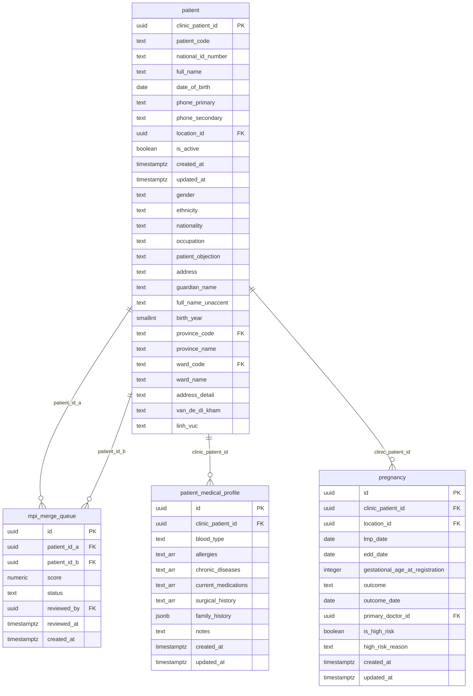
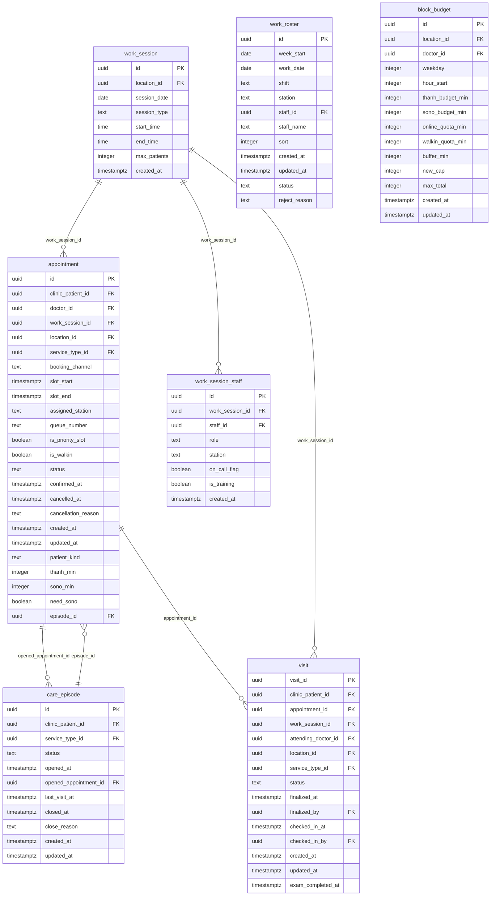
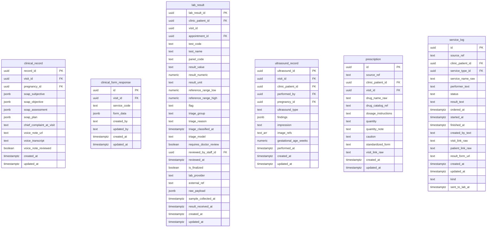
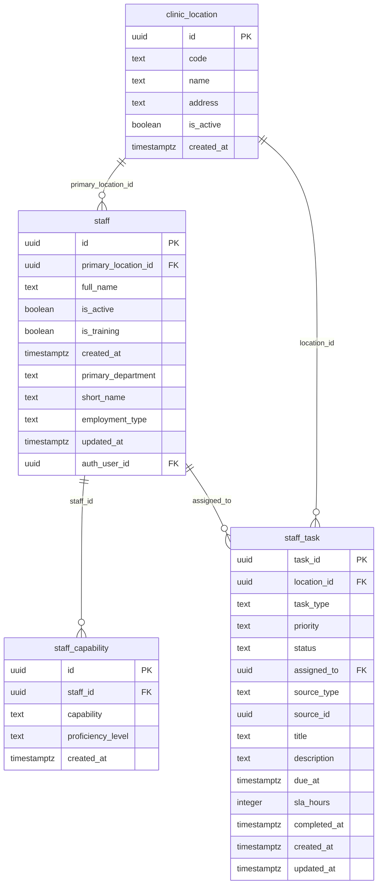
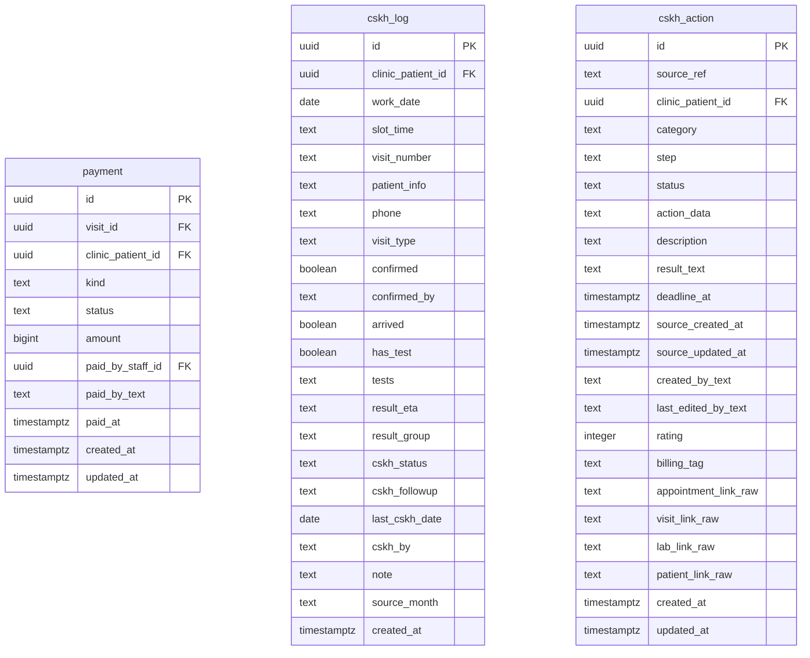
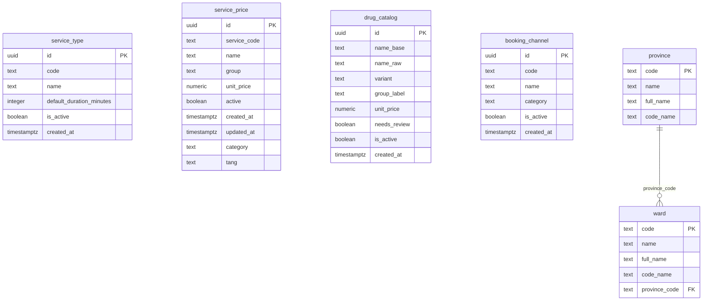
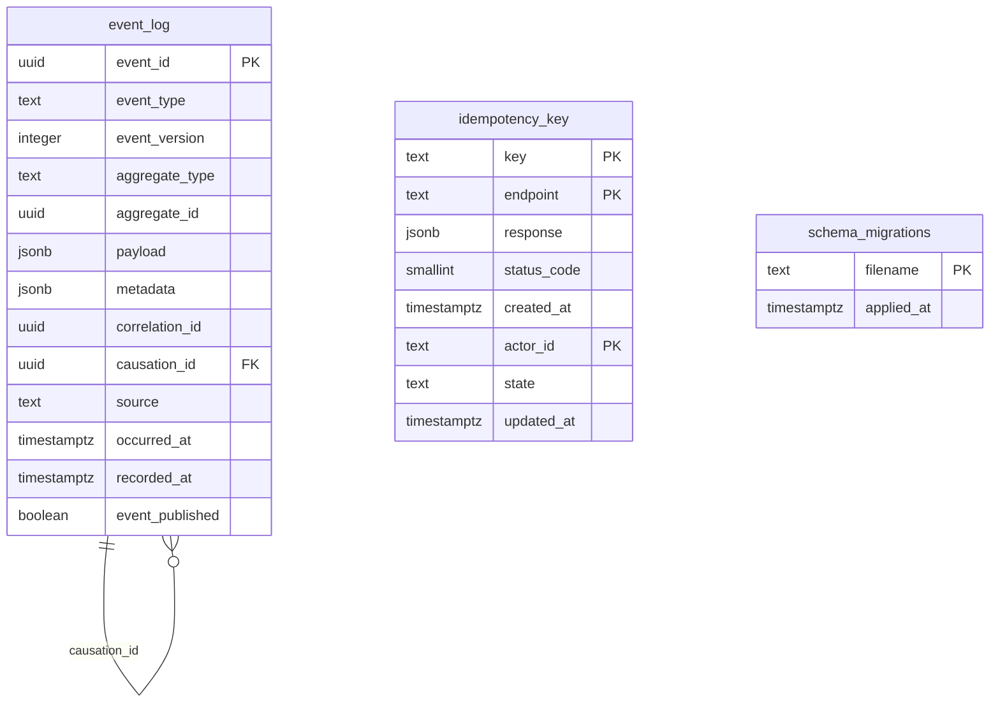
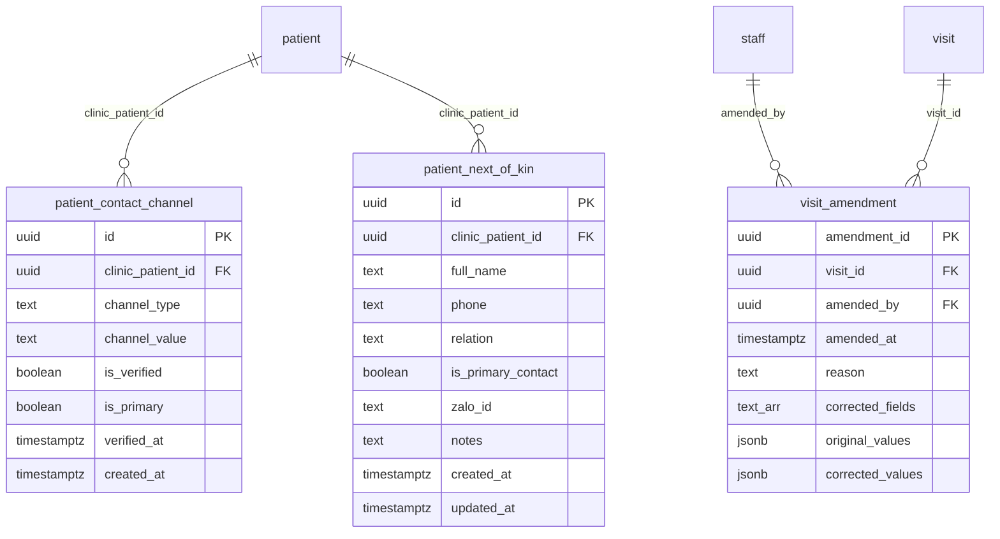

# 🗄️ Sơ đồ Database — Dr4Women (ClinicAI)

> **Nguồn (authoritative):** `supabase/migrations/*.sql` (git-tracked).  
> **Đối chiếu prod:** `docs/database/schema.sql` + `docs/database/drift-report.md`.  
> Dữ liệu nằm ở **Supabase cloud**; toàn bộ logic ở FastAPI backend (frontend chỉ UI).

**Quy mô:** 33 bảng theo migrations (32 baseline + `idempotency_key`). Prod hiện có 35 bảng do **schema drift** — xem §6.

Chú thích trạng thái:  
- ✅ **tracked+live** — có trong migrations và đang chạy ở prod.  
- 🟡 **tracked, chưa có ở prod** — đã định nghĩa trong migrations nhưng chưa `db push` lên prod (`idempotency_key`).  
- 🔴 **retired, còn ở prod** — đã bỏ khỏi baseline nhưng bảng cũ vẫn tồn tại ở prod (drift, chờ dọn).

Cú pháp **Mermaid ERD**: `||--o{` = quan hệ **một–nhiều**, `PK` khóa chính, `FK` khóa ngoại. Render trên GitHub / VS Code (Markdown Preview Mermaid) / https://mermaid.live

---

## 1. Bản đồ tổng thể theo domain

```mermaid
flowchart TB
  subgraph D0["🧑 Bệnh nhân & Định danh (MPI)"]
    patient
    patient_medical_profile
    mpi_merge_queue
    pregnancy
  end
  subgraph D1["📅 Lịch hẹn, Lượt khám & Hàng đợi"]
    appointment
    visit
    care_episode
    work_session
    work_roster
    work_session_staff
    block_budget
  end
  subgraph D2["🩺 Lâm sàng"]
    clinical_record
    clinical_form_response
    lab_result
    ultrasound_record
    prescription
    service_log
  end
  subgraph D3["👩‍⚕️ Nhân sự & Cơ sở"]
    staff
    staff_capability
    staff_task
    clinic_location
  end
  subgraph D4["💰 Thanh toán & CSKH"]
    payment
    cskh_log
    cskh_action
  end
  subgraph D5["📚 Danh mục & Tham chiếu"]
    service_type
    service_price
    drug_catalog
    booking_channel
    province
    ward
  end
  subgraph D6["⚙️ Hệ thống / Ops"]
    event_log
    idempotency_key
    schema_migrations
  end
  subgraph D7["⚠️ Bảng retired — còn sống ở prod (drift)"]
    patient_contact_channel
    patient_next_of_kin
    visit_amendment
  end
  appointment --> patient
  appointment --> staff
  appointment --> clinic_location
  appointment --> service_type
  block_budget --> staff
  block_budget --> clinic_location
  care_episode --> patient
  care_episode --> service_type
  clinical_form_response --> visit
  clinical_record --> pregnancy
  clinical_record --> visit
  cskh_action --> patient
  cskh_log --> patient
  lab_result --> appointment
  lab_result --> patient
  lab_result --> staff
  mpi_merge_queue --> staff
  patient --> clinic_location
  patient --> province
  patient --> ward
  payment --> patient
  payment --> staff
  payment --> visit
  pregnancy --> clinic_location
  pregnancy --> staff
  prescription --> patient
  prescription --> visit
  service_log --> patient
  service_log --> service_type
  ultrasound_record --> patient
  ultrasound_record --> staff
  ultrasound_record --> pregnancy
  ultrasound_record --> visit
  visit --> staff
  visit --> patient
  visit --> clinic_location
  visit --> service_type
  work_roster --> staff
  work_session --> clinic_location
  work_session_staff --> staff
  patient_contact_channel --> patient
  patient_next_of_kin --> patient
  visit_amendment --> staff
  visit_amendment --> visit
```

---

## 2. ERD chi tiết — 33 bảng theo migrations

> Gồm 32 bảng baseline + `idempotency_key` (🟡 chưa lên prod). 3 bảng retired xem §5.

```mermaid
erDiagram
  appointment {
    uuid id PK
    uuid clinic_patient_id FK
    uuid doctor_id FK
    uuid work_session_id FK
    uuid location_id FK
    uuid service_type_id FK
    text booking_channel
    timestamptz slot_start
    timestamptz slot_end
    text assigned_station
    text queue_number
    boolean is_priority_slot
    boolean is_walkin
    text status
    timestamptz confirmed_at
    timestamptz cancelled_at
    text cancellation_reason
    timestamptz created_at
    timestamptz updated_at
    text patient_kind
    integer thanh_min
    integer sono_min
    boolean need_sono
    uuid episode_id FK
  }
  block_budget {
    uuid id PK
    uuid location_id FK
    uuid doctor_id FK
    integer weekday
    integer hour_start
    integer thanh_budget_min
    integer sono_budget_min
    integer online_quota_min
    integer walkin_quota_min
    integer buffer_min
    integer new_cap
    integer max_total
    timestamptz created_at
    timestamptz updated_at
  }
  booking_channel {
    uuid id PK
    text code
    text name
    text category
    boolean is_active
    timestamptz created_at
  }
  care_episode {
    uuid id PK
    uuid clinic_patient_id FK
    uuid service_type_id FK
    text status
    timestamptz opened_at
    uuid opened_appointment_id FK
    timestamptz last_visit_at
    timestamptz closed_at
    text close_reason
    timestamptz created_at
    timestamptz updated_at
  }
  clinic_location {
    uuid id PK
    text code
    text name
    text address
    boolean is_active
    timestamptz created_at
  }
  clinical_form_response {
    uuid id PK
    uuid visit_id FK
    text service_code
    jsonb form_data
    text created_by
    text updated_by
    timestamptz created_at
    timestamptz updated_at
  }
  clinical_record {
    uuid record_id PK
    uuid visit_id FK
    uuid pregnancy_id FK
    jsonb soap_subjective
    jsonb soap_objective
    jsonb soap_assessment
    jsonb soap_plan
    text chief_complaint_at_visit
    text voice_note_url
    text voice_transcript
    boolean voice_note_reviewed
    timestamptz created_at
    timestamptz updated_at
  }
  cskh_action {
    uuid id PK
    text source_ref
    uuid clinic_patient_id FK
    text category
    text step
    text status
    text action_data
    text description
    text result_text
    timestamptz deadline_at
    timestamptz source_created_at
    timestamptz source_updated_at
    text created_by_text
    text last_edited_by_text
    integer rating
    text billing_tag
    text appointment_link_raw
    text visit_link_raw
    text lab_link_raw
    text patient_link_raw
    timestamptz created_at
    timestamptz updated_at
  }
  cskh_log {
    uuid id PK
    uuid clinic_patient_id FK
    date work_date
    text slot_time
    text visit_number
    text patient_info
    text phone
    text visit_type
    boolean confirmed
    text confirmed_by
    boolean arrived
    boolean has_test
    text tests
    text result_eta
    text result_group
    text cskh_status
    text cskh_followup
    date last_cskh_date
    text cskh_by
    text note
    text source_month
    timestamptz created_at
  }
  drug_catalog {
    uuid id PK
    text name_base
    text name_raw
    text variant
    text group_label
    numeric unit_price
    boolean needs_review
    boolean is_active
    timestamptz created_at
  }
  event_log {
    uuid event_id PK
    text event_type
    integer event_version
    text aggregate_type
    uuid aggregate_id
    jsonb payload
    jsonb metadata
    uuid correlation_id
    uuid causation_id FK
    text source
    timestamptz occurred_at
    timestamptz recorded_at
    boolean event_published
  }
  idempotency_key {
    text key PK
    text endpoint PK
    jsonb response
    smallint status_code
    timestamptz created_at
    text actor_id PK
    text state
    timestamptz updated_at
  }
  lab_result {
    uuid lab_result_id PK
    uuid clinic_patient_id FK
    uuid visit_id
    uuid appointment_id FK
    text test_code
    text test_name
    text panel_code
    text result_value
    numeric result_numeric
    text result_unit
    numeric reference_range_low
    numeric reference_range_high
    text flag
    text triage_group
    text triage_reason
    timestamptz triage_classified_at
    text triage_model
    boolean requires_doctor_review
    uuid reviewed_by_staff_id FK
    timestamptz reviewed_at
    boolean is_finalized
    text lab_provider
    text external_ref
    jsonb raw_payload
    timestamptz sample_collected_at
    timestamptz result_received_at
    timestamptz created_at
    timestamptz updated_at
  }
  mpi_merge_queue {
    uuid id PK
    uuid patient_id_a FK
    uuid patient_id_b FK
    numeric score
    text status
    uuid reviewed_by FK
    timestamptz reviewed_at
    timestamptz created_at
  }
  patient {
    uuid clinic_patient_id PK
    text patient_code
    text national_id_number
    text full_name
    date date_of_birth
    text phone_primary
    text phone_secondary
    uuid location_id FK
    boolean is_active
    timestamptz created_at
    timestamptz updated_at
    text gender
    text ethnicity
    text nationality
    text occupation
    text patient_objection
    text address
    text guardian_name
    text full_name_unaccent
    smallint birth_year
    text province_code FK
    text province_name
    text ward_code FK
    text ward_name
    text address_detail
    text van_de_di_kham
    text linh_vuc
  }
  patient_medical_profile {
    uuid id PK
    uuid clinic_patient_id FK
    text blood_type
    text_arr allergies
    text_arr chronic_diseases
    text_arr current_medications
    text_arr surgical_history
    jsonb family_history
    text notes
    timestamptz created_at
    timestamptz updated_at
  }
  payment {
    uuid id PK
    uuid visit_id FK
    uuid clinic_patient_id FK
    text kind
    text status
    bigint amount
    uuid paid_by_staff_id FK
    text paid_by_text
    timestamptz paid_at
    timestamptz created_at
    timestamptz updated_at
  }
  pregnancy {
    uuid id PK
    uuid clinic_patient_id FK
    uuid location_id FK
    date lmp_date
    date edd_date
    integer gestational_age_at_registration
    text outcome
    date outcome_date
    uuid primary_doctor_id FK
    boolean is_high_risk
    text high_risk_reason
    timestamptz created_at
    timestamptz updated_at
  }
  prescription {
    uuid id PK
    text source_ref
    uuid clinic_patient_id FK
    uuid visit_id FK
    text drug_name_raw
    text drug_catalog_ref
    text dosage_instructions
    text quantity
    text quantity_note
    text caution
    text standardized_form
    text visit_link_raw
    timestamptz created_at
    timestamptz updated_at
  }
  province {
    text code PK
    text name
    text full_name
    text code_name
  }
  schema_migrations {
    text filename PK
    timestamptz applied_at
  }
  service_log {
    uuid id PK
    text source_ref
    uuid clinic_patient_id FK
    uuid service_type_id FK
    text service_name_raw
    text performer_text
    text status
    text result_text
    timestamptz ordered_at
    timestamptz started_at
    timestamptz finished_at
    text created_by_text
    text visit_link_raw
    text patient_link_raw
    text result_form_url
    timestamptz created_at
    timestamptz updated_at
    text kind
    timestamptz sent_to_lab_at
  }
  service_price {
    uuid id PK
    text service_code
    text name
    text group
    numeric unit_price
    boolean active
    timestamptz created_at
    timestamptz updated_at
    text category
    text tang
  }
  service_type {
    uuid id PK
    text code
    text name
    integer default_duration_minutes
    boolean is_active
    timestamptz created_at
  }
  staff {
    uuid id PK
    uuid primary_location_id FK
    text full_name
    boolean is_active
    boolean is_training
    timestamptz created_at
    text primary_department
    text short_name
    text employment_type
    timestamptz updated_at
    uuid auth_user_id FK
  }
  staff_capability {
    uuid id PK
    uuid staff_id FK
    text capability
    text proficiency_level
    timestamptz created_at
  }
  staff_task {
    uuid task_id PK
    uuid location_id FK
    text task_type
    text priority
    text status
    uuid assigned_to FK
    text source_type
    uuid source_id
    text title
    text description
    timestamptz due_at
    integer sla_hours
    timestamptz completed_at
    timestamptz created_at
    timestamptz updated_at
  }
  ultrasound_record {
    uuid ultrasound_id PK
    uuid visit_id FK
    uuid clinic_patient_id FK
    uuid performed_by FK
    uuid pregnancy_id FK
    text ultrasound_type
    jsonb findings
    text impression
    text_arr image_refs
    numeric gestational_age_weeks
    timestamptz performed_at
    timestamptz created_at
    timestamptz updated_at
  }
  visit {
    uuid visit_id PK
    uuid clinic_patient_id FK
    uuid appointment_id FK
    uuid work_session_id FK
    uuid attending_doctor_id FK
    uuid location_id FK
    uuid service_type_id FK
    text status
    timestamptz finalized_at
    uuid finalized_by FK
    timestamptz checked_in_at
    uuid checked_in_by FK
    timestamptz created_at
    timestamptz updated_at
    timestamptz exam_completed_at
  }
  ward {
    text code PK
    text name
    text full_name
    text code_name
    text province_code FK
  }
  work_roster {
    uuid id PK
    date week_start
    date work_date
    text shift
    text station
    uuid staff_id FK
    text staff_name
    integer sort
    timestamptz created_at
    timestamptz updated_at
    text status
    text reject_reason
  }
  work_session {
    uuid id PK
    uuid location_id FK
    date session_date
    text session_type
    time start_time
    time end_time
    integer max_patients
    timestamptz created_at
  }
  work_session_staff {
    uuid id PK
    uuid work_session_id FK
    uuid staff_id FK
    text role
    text station
    boolean on_call_flag
    boolean is_training
    timestamptz created_at
  }
  patient ||--o{ appointment : "clinic_patient_id"
  staff ||--o{ appointment : "doctor_id"
  care_episode ||--o{ appointment : "episode_id"
  clinic_location ||--o{ appointment : "location_id"
  service_type ||--o{ appointment : "service_type_id"
  work_session ||--o{ appointment : "work_session_id"
  staff ||--o{ block_budget : "doctor_id"
  clinic_location ||--o{ block_budget : "location_id"
  patient ||--o{ care_episode : "clinic_patient_id"
  appointment ||--o{ care_episode : "opened_appointment_id"
  service_type ||--o{ care_episode : "service_type_id"
  visit ||--o{ clinical_form_response : "visit_id"
  pregnancy ||--o{ clinical_record : "pregnancy_id"
  visit ||--o{ clinical_record : "visit_id"
  patient ||--o{ cskh_action : "clinic_patient_id"
  patient ||--o{ cskh_log : "clinic_patient_id"
  event_log ||--o{ event_log : "causation_id"
  appointment ||--o{ lab_result : "appointment_id"
  patient ||--o{ lab_result : "clinic_patient_id"
  staff ||--o{ lab_result : "reviewed_by_staff_id"
  patient ||--o{ mpi_merge_queue : "patient_id_a"
  patient ||--o{ mpi_merge_queue : "patient_id_b"
  staff ||--o{ mpi_merge_queue : "reviewed_by"
  clinic_location ||--o{ patient : "location_id"
  patient ||--o{ patient_medical_profile : "clinic_patient_id"
  province ||--o{ patient : "province_code"
  ward ||--o{ patient : "ward_code"
  patient ||--o{ payment : "clinic_patient_id"
  staff ||--o{ payment : "paid_by_staff_id"
  visit ||--o{ payment : "visit_id"
  patient ||--o{ pregnancy : "clinic_patient_id"
  clinic_location ||--o{ pregnancy : "location_id"
  staff ||--o{ pregnancy : "primary_doctor_id"
  patient ||--o{ prescription : "clinic_patient_id"
  visit ||--o{ prescription : "visit_id"
  patient ||--o{ service_log : "clinic_patient_id"
  service_type ||--o{ service_log : "service_type_id"
  staff ||--o{ staff_capability : "staff_id"
  clinic_location ||--o{ staff : "primary_location_id"
  staff ||--o{ staff_task : "assigned_to"
  clinic_location ||--o{ staff_task : "location_id"
  patient ||--o{ ultrasound_record : "clinic_patient_id"
  staff ||--o{ ultrasound_record : "performed_by"
  pregnancy ||--o{ ultrasound_record : "pregnancy_id"
  visit ||--o{ ultrasound_record : "visit_id"
  appointment ||--o{ visit : "appointment_id"
  staff ||--o{ visit : "attending_doctor_id"
  staff ||--o{ visit : "checked_in_by"
  patient ||--o{ visit : "clinic_patient_id"
  staff ||--o{ visit : "finalized_by"
  clinic_location ||--o{ visit : "location_id"
  service_type ||--o{ visit : "service_type_id"
  work_session ||--o{ visit : "work_session_id"
  province ||--o{ ward : "province_code"
  staff ||--o{ work_roster : "staff_id"
  clinic_location ||--o{ work_session : "location_id"
  staff ||--o{ work_session_staff : "staff_id"
  work_session ||--o{ work_session_staff : "work_session_id"
```

---

## 3. ERD theo từng domain (dễ đọc)

### 🧑 Bệnh nhân & Định danh (MPI)

### 📅 Lịch hẹn, Lượt khám & Hàng đợi

### 🩺 Lâm sàng

### 👩‍⚕️ Nhân sự & Cơ sở

### 💰 Thanh toán & CSKH

### 📚 Danh mục & Tham chiếu

### ⚙️ Hệ thống / Ops

---

## 4. Khóa ngoại liên schema (ngoài `public`)

| Bảng nguồn | Cột | → | Đích |
|---|---|---|---|
| `staff` | `auth_user_id` | → | `auth.users(id)` |

---

## 5. 🔴 Bảng retired còn sống ở prod (drift)

> Đã gỡ khỏi baseline hợp nhất nhưng vẫn tồn tại ở prod. **Không drop** trước khi rà dữ liệu & consumer (theo drift-report §Extra retired objects).

---

## 6. Tóm tắt schema drift (migrations ↔ prod)

Nguồn: `docs/database/drift-report.md` (generated 2026-07-23).

| Hạng mục | Migrations (đúng) | Prod (thực tế) | Khác biệt chính |
|---|---:|---:|---|
| Bảng public | 33 | 35 | 1 bảng thiếu (`idempotency_key`); 3 bảng retired còn sót |
| Function public | 19 | 9 | 11 function chưa lên prod (atomic queue/check-in, slot-capacity, idempotency, event-log least-privilege) |
| Index public | 117 | 120 | 6 index thiếu; 9 index thuộc bảng retired |
| Policy `event_log` | narrow (management) | broad (authenticated) | Prod vẫn cho mọi user auth `SELECT` event_log |

**Hành động khuyến nghị (drift-report §Recommended):** tạo 1 migration reconcile forward-only → thêm idempotency/capacity/queue/index/authorization còn thiếu, thay `f_unaccent`, xác minh 3 bảng retired an toàn rồi mới drop; test trên staging trước.

---

## 7. Danh mục toàn bộ bảng

| # | Bảng | Domain | Trạng thái | Cột | Khóa chính | FK |
|---|---|---|---|---:|---|---:|
| 1 | `appointment` | 📅 Lịch hẹn, Lượt khám & Hàng đợi | ✅ tracked+live | 24 | id | 6 |
| 2 | `block_budget` | 📅 Lịch hẹn, Lượt khám & Hàng đợi | ✅ tracked+live | 14 | id | 2 |
| 3 | `booking_channel` | 📚 Danh mục & Tham chiếu | ✅ tracked+live | 6 | id | 0 |
| 4 | `care_episode` | 📅 Lịch hẹn, Lượt khám & Hàng đợi | ✅ tracked+live | 11 | id | 3 |
| 5 | `clinic_location` | 👩‍⚕️ Nhân sự & Cơ sở | ✅ tracked+live | 6 | id | 0 |
| 6 | `clinical_form_response` | 🩺 Lâm sàng | ✅ tracked+live | 8 | id | 1 |
| 7 | `clinical_record` | 🩺 Lâm sàng | ✅ tracked+live | 13 | record_id | 2 |
| 8 | `cskh_action` | 💰 Thanh toán & CSKH | ✅ tracked+live | 22 | id | 1 |
| 9 | `cskh_log` | 💰 Thanh toán & CSKH | ✅ tracked+live | 22 | id | 1 |
| 10 | `drug_catalog` | 📚 Danh mục & Tham chiếu | ✅ tracked+live | 9 | id | 0 |
| 11 | `event_log` | ⚙️ Hệ thống / Ops | ✅ tracked+live | 13 | event_id | 1 |
| 12 | `lab_result` | 🩺 Lâm sàng | ✅ tracked+live | 28 | lab_result_id | 3 |
| 13 | `mpi_merge_queue` | 🧑 Bệnh nhân & Định danh (MPI) | ✅ tracked+live | 8 | id | 3 |
| 14 | `patient` | 🧑 Bệnh nhân & Định danh (MPI) | ✅ tracked+live | 27 | clinic_patient_id | 3 |
| 15 | `patient_medical_profile` | 🧑 Bệnh nhân & Định danh (MPI) | ✅ tracked+live | 11 | id | 1 |
| 16 | `payment` | 💰 Thanh toán & CSKH | ✅ tracked+live | 11 | id | 3 |
| 17 | `pregnancy` | 🧑 Bệnh nhân & Định danh (MPI) | ✅ tracked+live | 13 | id | 3 |
| 18 | `prescription` | 🩺 Lâm sàng | ✅ tracked+live | 14 | id | 2 |
| 19 | `province` | 📚 Danh mục & Tham chiếu | ✅ tracked+live | 4 | code | 0 |
| 20 | `schema_migrations` | ⚙️ Hệ thống / Ops | ✅ tracked+live | 2 | filename | 0 |
| 21 | `service_log` | 🩺 Lâm sàng | ✅ tracked+live | 19 | id | 2 |
| 22 | `service_price` | 📚 Danh mục & Tham chiếu | ✅ tracked+live | 10 | id | 0 |
| 23 | `service_type` | 📚 Danh mục & Tham chiếu | ✅ tracked+live | 6 | id | 0 |
| 24 | `staff` | 👩‍⚕️ Nhân sự & Cơ sở | ✅ tracked+live | 11 | id | 2 |
| 25 | `staff_capability` | 👩‍⚕️ Nhân sự & Cơ sở | ✅ tracked+live | 5 | id | 1 |
| 26 | `staff_task` | 👩‍⚕️ Nhân sự & Cơ sở | ✅ tracked+live | 15 | task_id | 2 |
| 27 | `ultrasound_record` | 🩺 Lâm sàng | ✅ tracked+live | 13 | ultrasound_id | 4 |
| 28 | `visit` | 📅 Lịch hẹn, Lượt khám & Hàng đợi | ✅ tracked+live | 15 | visit_id | 8 |
| 29 | `ward` | 📚 Danh mục & Tham chiếu | ✅ tracked+live | 5 | code | 1 |
| 30 | `work_roster` | 📅 Lịch hẹn, Lượt khám & Hàng đợi | ✅ tracked+live | 12 | id | 1 |
| 31 | `work_session` | 📅 Lịch hẹn, Lượt khám & Hàng đợi | ✅ tracked+live | 8 | id | 1 |
| 32 | `work_session_staff` | 📅 Lịch hẹn, Lượt khám & Hàng đợi | ✅ tracked+live | 8 | id | 2 |
| 33 | `idempotency_key` | ⚙️ Hệ thống / Ops | 🟡 tracked, CHƯA có ở prod | 8 | key, endpoint, actor_id | 0 |
| 34 | `patient_contact_channel` | ⚠️ Bảng retired | 🔴 retired, CÒN ở prod | 8 | id | 1 |
| 35 | `patient_next_of_kin` | ⚠️ Bảng retired | 🔴 retired, CÒN ở prod | 10 | id | 1 |
| 36 | `visit_amendment` | ⚠️ Bảng retired | 🔴 retired, CÒN ở prod | 8 | amendment_id | 2 |
