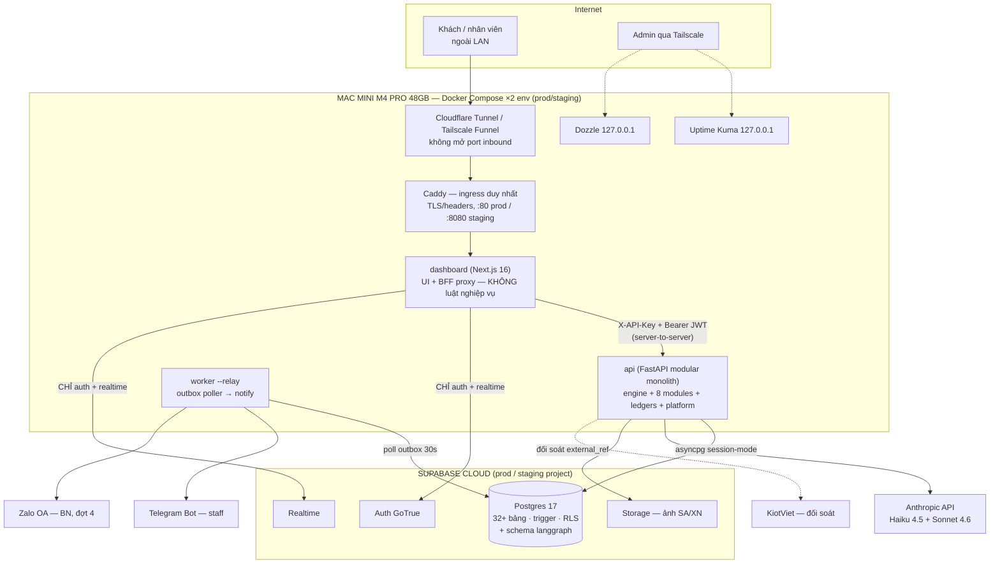
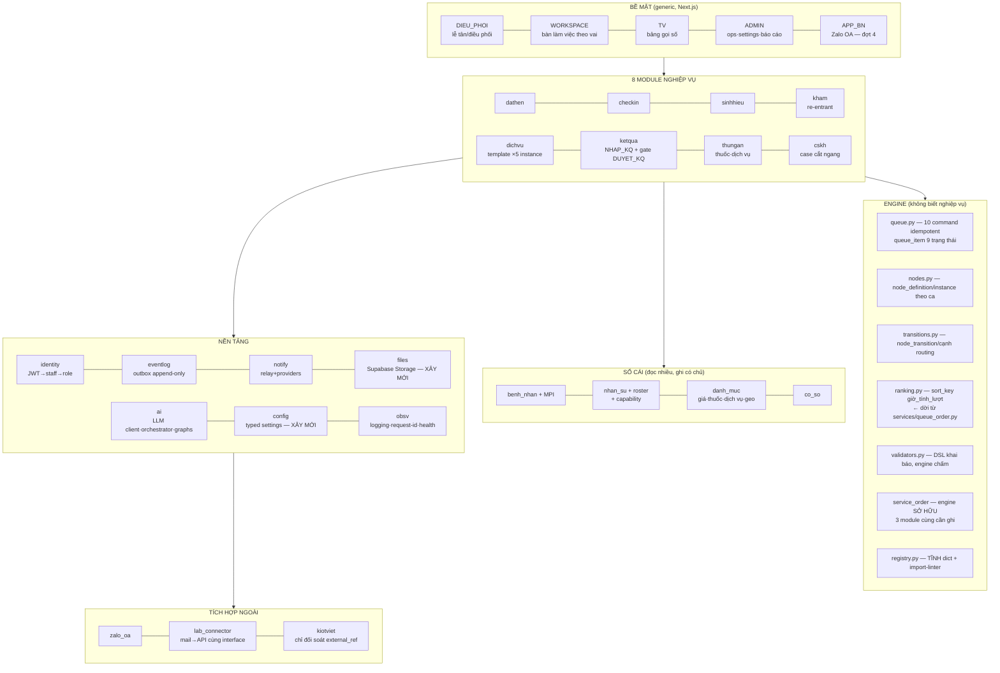

# ClinicAI — System Design v5 (Mac mini M4 Pro 48GB, module hoá)

| | |
|---|---|
| **Tác giả** | Claude (khảo sát 9-agent toàn repo) + Quang duyệt |
| **Trạng thái** | Draft — chờ Quang review |
| **Ngày** | 2026-07-18 |
| **Thay thế** | Hợp nhất `docs/design/clinicai-module-map-v3.html` (luồng BN) + `clinicai-system-map-v4.html` (toàn hệ) + `clinicai-as-is-map.html` (hiện trạng) thành MỘT tài liệu markdown — hết phụ thuộc JS render |
| **ADR liên quan** | ADR-0001 … ADR-0008 (`docs/adr/`) — mỗi ADR có mục **Affected decisions (canon 06)** ghi tường minh chuỗi supersede |
| **Nguồn sự thật phân tầng** | HARD DECISIONS `final_canon/06` (kiểm chứng lại từng D trước khi viện dẫn) → HANDOFF.md §2 (quyết định đã chốt với Quang) → code hiện tại (as-is map 17-07 + khảo sát 18-07) → spec-clinic.md (khung phase hạ tầng) |

---

## 1. Context & Scope (Bối cảnh & phạm vi)

ClinicAI là hệ vận hành phòng khám sản phụ khoa Dr4Women: đặt lịch kiểu "rạp chiếu phim"
2+1, check-in/hàng đợi, hồ sơ lâm sàng SOAP + form chuyên khoa, siêu âm/xét nghiệm,
thu tiền, CSKH, roster — cho ~41 nhân sự / 11 vai. Toàn bộ app chạy trên **một Mac mini
M4 Pro 48GB** bằng Docker Compose (prod + staging song song); **dữ liệu ở Supabase cloud**
(ràng buộc an toàn: Mac chết = tạm không truy cập, KHÔNG mất data).

Tài liệu này là bản thiết kế **module hoá** hợp nhất: kế thừa taxonomy đã ổn định qua 4
vòng (v1 → as-is → v3 → v4), đối chiếu với hiện trạng code thật (khảo sát 18-07 bằng 9
agent đọc toàn repo), và chốt các quyết định kiến trúc còn treo. Nó là **bản đồ đích +
lộ trình di trú**, không phải mô tả hiện trạng (hiện trạng xem `clinicai-as-is-map.html`).

**Hệ thống ở đâu trong bức tranh lớn:** đây là giai đoạn "1 node + Supabase" — thiết kế
phải *lift-and-shift được lên VPS* (mọi thứ container + env-driven), nhưng KHÔNG được
over-engineer cho quy mô chưa tới (spec §6: cấm k8s / HA / sharding / multi-region).
Multi-site đã trong tầm nhìn (2 cơ sở Kim Ngưu + Hào Nam): **`location_id` bắt buộc trên
mọi entity vận hành** (D021/FAD-20 — schema đã có, module mới phải giữ).

**Chốt ngã rẽ kiến trúc mà `context/SO_SANH_WEB_VS_LOI.md` §4 nêu:** chọn **hướng A —
web ghi qua FastAPI lõi** (chính là Phase 4 đang làm), CỘNG net cứng Postgres cho các
invariant concurrency (không phải hướng B "đưa hết luật xuống SQL function"). Canon
event-driven RabbitMQ + Golden-Record-single-writer (final_canon A2 tầng 0A–0C) chính
thức **không còn là kiến trúc đích** ở quy mô này — thay bằng modular monolith + outbox
(ADR-0001, ADR-0002 supersede FAD-4/D006).

## 2. Goals / Non-Goals

**Goals**
1. **Module hoá modular monolith**: ranh giới module nằm trong code (thư mục + manifest +
   CI checker), không nằm trong hạ tầng. Thêm nghiệp vụ = thêm module, không sửa engine/UI.
2. **Frontend = UI only** (đích Phase 4): mọi luật nghiệp vụ ở FastAPI service / SQL;
   FE nối thẳng Supabase CHỈ cho auth + realtime.
3. **Đúng đắn dưới concurrency** ở các invariant tiền/chỗ/số thứ tự/hồ sơ — enforce tại
   Postgres (trigger + advisory lock), app chỉ dịch SQLSTATE → HTTP.
4. **Chạy 24/7 tự phục hồi** trên 1 Mac mini, có ngân sách tài nguyên tường minh cho 48GB.
5. **An toàn y tế + PII**: GROUP_C hard-block, FINALIZED bất biến, per-staff identity,
   log redaction — giữ ở MỌI surface mới.
6. **Đóng được các lỗ đã phát hiện** trong khảo sát (auth gap, idempotency gap, dual-logic,
   outbox dual-semantics…) như một phần của thiết kế, không phải vá lẻ.

**Non-Goals (out of scope — đừng làm)**
- Kubernetes, microservices, service mesh, HA đa node, sharding, multi-region, consensus.
- Chuyển database ra khỏi Supabase (ràng buộc an toàn dữ liệu).
- Local LLM cho reasoning (Anthropic API là đủ; chỉ voice STT là on-prem — xem §5.7).
- App bệnh nhân (Zalo OA) đầy đủ — chỉ chừa chỗ trong kiến trúc (đợt 4).
- Realtime engine tự viết — Supabase Realtime là đủ.

## 3. Requirements

### 3.1 Functional (FR) — 8 nghiệp vụ lõi

| # | Nghiệp vụ | Module đích |
|---|---|---|
| FR1 | Đặt hẹn 2+1 mỗi khung 15' (2 đặt trước + 1 walk-in), CAP-01 advisory tô màu | `dathen` |
| FR2 | Check-in cấp số thứ tự atomic theo ngày VN, mở visit | `checkin` |
| FR3 | Sinh hiệu (ĐD, sau check-in, 3 chỉ số bắt buộc) | `sinhhieu` |
| FR4 | Khám (SOAP + form chuyên khoa + đơn thuốc + chỉ định), re-entrant khi có KQ | `kham` |
| FR5 | Dịch vụ (siêu âm ×2 trạm, lấy mẫu, thủ thuật, POCT) — 1 template × 5 instance | `dichvu` |
| FR6 | Kết quả XN: nhập KQ, AI triage GROUP_A/B/C, gate BS duyệt, trả BN | `ketqua` |
| FR7 | Thu tiền theo vai (thuốc/dịch vụ), gate COMPLETED, đối soát KiotViet | `thungan` |
| FR8 | CSKH: xác nhận hẹn, nhắc lịch, trả KQ, case cắt ngang | `cskh` |

Xuyên suốt: hàng đợi + gọi lượt (engine), sổ cái BN/nhân sự/danh mục, thông báo
(Telegram nội bộ → Zalo OA cho BN), AI trợ lý (triage, brief, chat), báo cáo.

### 3.2 Non-Functional (NFR) — có số cụ thể

| NFR | Mục tiêu | Ghi chú |
|---|---|---|
| Quy mô | 50–80 BN/ngày; ~15–25 client đồng thời giờ cao điểm | T2–T6 17–23h, T7/CN 8–23h |
| Throughput | Peak **< 1 RPS** user-initiated; burst realtime-refresh ~20–50 query/s về Supabase | xem §4 |
| Latency | API CRUD p95 < 500ms; booking/check-in p95 < 800ms (gồm advisory lock); brief LLM < 15s (sync, sẽ async hoá) | Supabase ở `aws-ap-northeast-2` (Seoul), RTT VN ~30–80ms |
| Availability | **99.5%/tháng giờ mở cửa** (nội bộ, ≈ 1.8h downtime/tháng); RTO Mac reboot 3'; RTO Mac chết hẳn = chuyển VPS ≤ 1 ngày; **RPO ≈ 0** (data ở Supabase + PITR) | Có phương án giấy (RUNBOOK) |
| Consistency | Strong cho chỗ/số/tiền/hồ sơ chốt; eventual cho board/report/notify | bảng §5.6 |
| Durability | Supabase PITR + pg_dump đêm (đã drill 17-07) + offsite R2 (phải bật) | |
| Security | Per-staff JWT, RLS read, fail-closed API key, PII redaction, FileVault, không mở port inbound | §6.1 |
| Compliance | TT13/2011 (hồ sơ FINALIZED bất biến — D009) · **TT13/2025 bệnh án điện tử, hạn 31/12/2026** (cần thêm chữ ký số BS khi chốt) · **TT04/2022 đơn thuốc điện tử liên thông donthuocquocgia.vn — ĐÃ QUÁ HẠN từ 30/6/2023** · NĐ123/2020+NĐ70/2025 hoá đơn điện tử tại thời điểm thu · NĐ13/2023 (audio on-prem — D011; KQ gửi đích danh, không đăng nhóm Zalo chung) | đưa vào roadmap đợt 2–3 (§8) |
| Vận hành | **D036 (ràng buộc Hoa): hệ thống KHÔNG được phát sinh thêm việc cho nhân viên — net effort ≤ 0.** Deployment blocker cho mọi module mới | tiêu chí XONG mỗi đợt |

## 4. Capacity Estimation → quyết định kéo theo

Mỗi con số dẫn tới một quyết định. Số nền: 80 BN/ngày đỉnh, 41 nhân sự, ~20 client đồng thời.

**Traffic.** 80 BN × ~30 thao tác staff/lượt (đặt–checkin–sinh hiệu–khám–SA–XN–thu) ≈
2.400 request nghiệp vụ/ngày, dồn 6h tối → **avg 0.1 RPS, peak ×10 ≈ 1 RPS**. → *Một
FastAPI process (uvicorn 1 worker) là đủ; không cần LB, không cần scale ngang. Mọi đầu tư
đúng đắn dồn vào concurrency-correctness (2 lễ tân cùng bấm), không phải throughput.*

**Khuếch đại realtime (bottleneck thật #1).** 1 write → publication 18 bảng → mọi client
`router.refresh()` (debounce 1.2s) → mỗi refresh chạy lại toàn bộ server-component query
của trang. 20 client × ~5–10 query = **100–200 query/burst mỗi thay đổi**, cộng poll nền
25s/client. → *Quyết định: (a) giữ mô hình này cho ≤25 client (đã chạy ổn), (b) thiết kế
đích chuyển sang subscription scoped-theo-trang + đọc từ API engine (§5.3), KHÔNG tự viết
realtime engine.*

**Kết nối Supabase (bottleneck thật #2).** Mỗi api container: asyncpg pool max 10 +
psycopg checkpointer pool max 10 = 20; × 2 env = 40; + relay 10×2 = 60; + PostgREST/
Realtime phía Supabase tự quản. → *Quyết định: giữ pool nhỏ (10) là ĐÚNG; mọi kết nối
backend đi qua **Supavisor session mode :5432** vì (a) relay dùng session advisory lock,
(b) `pg_advisory_xact_lock` trong trigger cần transaction nguyên vẹn. KHÔNG chuyển
transaction-mode :6543 nếu chưa rà lại 2 chỗ lock này (ghi trong ADR-0003).*

**Storage.** Hồ sơ text/jsonb: 80 BN/ngày × ~50KB ≈ 1.5GB/năm — không đáng kể. **Ảnh
SA/XN là khoản lớn duy nhất**: ~20K file/năm × 300KB–1MB ≈ 6–20GB/năm. → *Quyết định:
bắt buộc xây `platform/files` trên Supabase Storage + signed URL (đợt 3), KHÔNG lưu ảnh
trên Mac, KHÔNG nhét vào Postgres.*

**LLM.** Vài chục–trăm call/ngày: chat ~$0.005/lượt, triage $0–0.006 (rule-first),
brief $0.015–0.03 → **$1–5/ngày (~$30–150/tháng)**. → *Chi phí không phải constraint;
latency brief 5–15s sync mới là vấn đề → async hoá + Batch API cho brief đêm (P13).
Cần cost guard chống loop lỗi (§6.3), không cần tối ưu giá sâu.*

**RAM 48GB (ngân sách tường minh — hiện chưa có limit nào!).** Đo thực tế 18-07: cả stack
~560–700MB, Colima VM 7.7GB. → *Quyết định: ngân sách §5.8 + mem limit từng container +
codify Colima VM size vào script (ADR-0006). Rủi ro un-budgeted lớn nhất: PhoWhisper
lazy-load 1–3GB vào api process — phải cô lập.*

## 5. The Design

### 5.1 Kiến trúc high-level



**Source of truth:** Postgres (Supabase) cho MỌI dữ liệu nghiệp vụ; `event_log` cho audit;
engine tables cho trạng thái hàng đợi; browser/Next KHÔNG bao giờ là nguồn sự thật.

**Data flow chuẩn của 1 thao tác nghiệp vụ:**
`Surface → Next route (BFF, chỉ forward) → FastAPI module command → service → SQL
(trigger enforce invariant) → outbox event → (a) Realtime đẩy UI, (b) relay đẩy notify.`

### 5.2 Nguyên tắc module hoá (4 luật — giữ nguyên văn từ v4)

1. **Engine không biết nghiệp vụ.** Engine chỉ biết queue_item / node / transition /
   ranking / validator. "Khám", "siêu âm" là data (node_definition), không phải code engine.
2. **Module không GHI chéo.** Ghi qua command/event; đọc qua provides/consumes khai báo
   tường minh trong manifest. Mỗi bảng có đúng **một module writer** (CI checker đọc manifest).
3. **Bề mặt là hàng generic.** DIEU_PHOI/WORKSPACE/TV render theo node_definition + form
   schema từ backend — thêm module không sửa UI shell.
4. **Modular monolith.** Module = thư mục trong 1 FastAPI + 1 Postgres. Ranh giới trong
   code (import-linter + manifest), không trong hạ tầng. (Peak 1 RPS — tách service là
   over-engineering; xem ADR-0001.)

### 5.3 Bản đồ module (taxonomy v5 — kế thừa v4, đối chiếu code thật)



**Hợp đồng module — manifest 7 mục** (mỗi module 1 file `manifest.py`, CI đọc được):

```
owns_tables      # bảng module này là WRITER duy nhất
api              # endpoints public của module (router mỏng)
nodes            # node_definition mà module đăng ký vào engine
form_schema      # schema form phục vụ surface render (server-served)
events           # emit / listen (tên event versioned)
provides / consumes  # dữ liệu đọc chéo tường minh
permissions      # role nào được command nào (map primary_department)
```

**Ánh xạ as-is → to-be (điểm neo di trú, kế thừa v4 §06b + khảo sát 18-07):**

| Hiện tại (chạy thật) | Đích v5 | Hành động |
|---|---|---|
| Trigger 2+1 + `pg_advisory_xact_lock` (mig 20260714000002) | `dathen` net cứng | **GIỮ NGUYÊN CHỖ** (DB) |
| RPC `check_in_appointment` atomic (mig 20260717000002) | `checkin` | GIỮ NGUYÊN CHỖ |
| `event_log` outbox + append-only guard | `platform/eventlog` | GIỮ; tách delivery state (§5.5) |
| `services/queue_order.py` (+ bản TS `lib/queue.ts` trùng) | `engine/ranking.py` | DỜI; **xoá bản TS** — FE đọc API |
| `app/api/appointments/route.ts` 1064 dòng (state machine + 7 side-effects) | `dathen`+`checkin` commands + transition engine | DỜI DẦN theo cụm, flag per-route |
| `lib/form-schemas/` 1044 dòng TS (5 form) | `kham`/`dichvu` form_schema server-served | DỜI (Phase 4 #6) |
| Clinical gates trong Next routes (FINALIZED/48h/ownership/vitals-after-checkin) | `kham` + DB trigger append-only (mig 043) | DỜI + hạ net xuống DB |
| `payment_service.py` (đã port, flag `PAYMENT_VIA_BACKEND`) | `thungan` | BẬT flag → xoá đường Next |
| MPI scoring + merge queue (chưa có resolve flow) | `benh_nhan` ledger | GIỮ + xây resolve + sửa trọng số (§9) |
| Lab triage graph (KQ **chưa được persist**!) | `ketqua` | Việc #1 của module: persist triage + gate |
| Orchestrator chat / scheduling graph (confirm không tạo lịch!) | `platform/ai`, chờ APP_BN | GATE debug-only; **tắt scheduling graph** tới khi nối tool thật |
| RabbitMQ + event_bus skeleton (publisher NotImplementedError) | — | **XOÁ** (ADR-0002) |
| `golden_record/`, `WalkinAdapter`, stubs, `render.yaml`, role-picker | — | XOÁ dead code |
| `patient_code` có **3 bản sinh** (JS Date.now / Python microsecond / bulk advisory-lock) | `benh_nhan` | HỢP NHẤT về 1 bản backend (Python + UNIQUE net) |
| Telegram = kênh notify duy nhất đang chạy | `platform/notify` | GIỮ làm kênh staff **TẠM THỜI** (supersede có rào A-15 — xem ADR-0002 Affected decisions). End-state theo D010: staff = **Zalo OA Internal**, BN = **Zalo OA** — không bao giờ dùng Telegram/SMS cho BN; Telegram nghỉ khi Zalo OA Internal chạy (đợt 4) |

### 5.4 API design (hợp đồng chung mọi module)

- **Auth 2 lớp, fail-closed** (ADR-0004): lớp 1 `X-API-Key` service-to-service (app
  **từ chối boot** khi `BACKEND_API_KEY` trống ở production — sửa fail-open hiện tại);
  lớp 2 Supabase JWT → `staff.auth_user_id` → role = `primary_department`.
  **Mọi endpoint nghiệp vụ bắt buộc lớp 2** (`require_role`) — đóng gap hiện tại ở
  staff/scheduling/queue/tools/orchestrator/brief/lab/voice/catalog\*.
  (\*catalog read-only có thể miễn JWT nhưng vẫn sau API key.)
- **Idempotency bắt buộc** cho mọi POST có side-effect: `Idempotency-Key` header, scope
  `(key, endpoint, actor_id)` — actor lấy từ JWT đã verify, **không bao giờ scope rỗng**
  (sửa POST /appointments hiện tại). DB-backed (bảng `idempotency_key`), TTL 24h +
  pg_cron prune (bảng đang phình vô hạn — thêm job).
- **Error contract:** `{error: CODE, message}` (message tiếng Việt là một phần hợp đồng
  với dashboard); 409 = conflict nghiệp vụ (slot đầy, trạng thái sai), 422 = input,
  403 = SafetyGate/role, 503 + `Retry-After` = DB outage.
- **Command-style endpoints** cho engine: `POST /api/v1/queue-items/{id}:transition`
  (10 command idempotent của v3: enqueue/call/start/hold/resume/block/complete/route/
  cancel/no_show) — không PATCH tự do trạng thái.
- **Versioning:** giữ `/api/v1`; event có `event_version`.
- **Nội bộ/dev plane tách khỏi prod:** `tools.py` + `orchestrator/chat` + `/docs` chỉ
  mount khi `APP_ENV != production` hoặc sau `require_role(MANAGEMENT)`.
- **Pagination:** cursor cho danh sách BN/event; các board theo ngày thì filter ngày là đủ.
- **Timezone:** MỌI "hôm nay" đi qua helper `core/clinic_time.py` (Asia/Ho_Chi_Minh) —
  xoá 3 chỗ `date.today()` server-local đang lệch ngày 00:00–07:00 VN.

### 5.5 Data model & storage

**Nguyên tắc:** thiết kế theo access pattern; Postgres cho mọi thứ có cấu trúc;
Storage cho binary; KHÔNG thêm hệ lưu trữ mới (không Redis/Mongo — ADR-0005).

**Nhóm bảng hiện có (32) giữ nguyên chủ quyền theo module:**

| Domain (bảng chính) | Module writer duy nhất |
|---|---|
| patient, patient_medical_profile, mpi_merge_queue | `benh_nhan` |
| appointment, care_episode, block_budget, booking_channel | `dathen` (checkin transition qua RPC) |
| visit, clinical_record, clinical_form_response, prescription, pregnancy | `kham` |
| ultrasound_record, service_log | `dichvu` |
| lab_result | `ketqua` |
| payment, service_price, drug_catalog | `thungan` (giá/thuốc: `danh_muc` đọc) |
| cskh_action, cskh_log | `cskh` |
| staff, staff_capability, work_session(_staff), work_roster, staff_task | `nhan_su` |
| clinic_location, service_type, province, ward | `danh_muc` / `co_so` |
| event_log, idempotency_key | `platform` |

**Bảng MỚI (đợt 1–2, engine):** `queue_item` (subject=PATIENT, 9 trạng thái, sort_key),
`node_definition` + `node_instance` (theo ca), `node_transition` (append-only),
`service_order` (engine-owned — kham phát hành, dichvu cập nhật, ketqua gắn KQ).
**Bảng MỚI (đợt 3):** `notification_delivery` (tách delivery state khỏi `event_log` —
sửa dứt điểm dual-semantics của `event_published`: EventService coi là "đã lên MQ",
relay coi là "đã gửi notify"; hai writer giẫm nhau. `event_log` chỉ còn là audit/outbox
gốc; mỗi kênh gửi có row riêng: event_id, channel, status, attempts, next_retry_at →
có backoff + poison-message handling, hết starvation batch 50).
**Cột gate lab ĐÃ CÓ SẴN** (triage_group, requires_doctor_review, reviewed_by/at,
is_finalized + constraint đòi reviewer) — thiếu **writer**, không thiếu schema.

**Net cứng cần HẠ XUỐNG DB (hiện chỉ app-layer):**
1. Append-only `visit` FINALIZED (migration 043 pending) — UPDATE trực tiếp row
   FINALIZED bị chặn hoàn toàn; đính chính CHỈ qua RPC `amend_visit` ghi audit
   `visit.amended` vào `event_log` trong cùng transaction (**ADR-0008** — supersede
   cơ chế bảng `visit_amendment` của D008/D009, giữ nguyên intent bất biến + dấu vết).
   Xoá "48h age-lock" giả pháp lý ở Next route sau khi có trigger + RPC.
2. Chống trùng giờ bác sĩ: exclusion constraint `appointment_no_doctor_overlap` đã bị
   DROP (mig 057 legacy) nhưng code Python/TS vẫn map lỗi của nó (dead path). Quyết định:
   **KHÔNG khôi phục exclusion constraint** (double-book có chủ đích là nghiệp vụ thật —
   2+1 chính là cho phép chồng trong bucket); luật "≥6 lịch trùng khung" giữ app-layer
   advisory, ghi rõ fail-open. Xoá error-mapping 23P01 chết ở cả 2 phía.
3. `booking_channel` text tự do → FK về bảng `booking_channel` (typo kênh = lách lưới 2+1).
4. `service_log.status` 2 bộ từ vựng Việt/Anh trên 1 cột → CHECK + migrate data.
5. RLS: bật RLS cho `idempotency_key` (đang hở PostgREST); thu hẹp SELECT per-role cho
   bảng PII nặng (lễ tân không đọc SOAP) — đợt 3, dùng mẫu `current_staff_department()`.

**Index:** đã có gin_trgm/unaccent (search tên VN qua cột generated `full_name_unaccent`)
+ 4 hot-path index (mig 00004). Thêm: expression index cho ngày VN của queue
(`(slot_start AT TIME ZONE 'Asia/Ho_Chi_Minh')::date`) khi dữ liệu lớn dần.

**Migration kỷ luật:** chỉ `supabase/migrations/*.sql` + `supabase db push`, chạy TRƯỚC
app release, tách khỏi CD. **KHÔNG yêu cầu DOWN script** — supersede tường minh canon
A-25/B-3: Supabase CLI không có down-migration workflow chuẩn; rollback schema =
**PITR + forward-fix migration** (nguyên tắc forward-only, khớp thực tế 8 migration
hiện có). **Ngoại lệ được ghi nhận:** schema `langgraph` do `saver.setup()` tự tạo lúc
boot (ADR-0007 — ngoại lệ có chủ đích, giới hạn trong schema riêng, không đụng `public`).

### 5.6 Consistency & reliability map

| Dữ liệu / thao tác | Mức | Cơ chế |
|---|---|---|
| Chỗ 2+1 mỗi bucket 15' | **Strong** | trigger + `pg_advisory_xact_lock(doctor,bucket,kind)` — ĐÃ CÓ |
| Số thứ tự ngày VN | **Strong** | RPC service_role-only + advisory lock ngày — ĐÃ CÓ |
| Payment (visit,kind) | **Strong** | unique + gate COMPLETED + idempotency key — ĐÃ CÓ (bật flag) |
| Hồ sơ FINALIZED | **Strong** | trigger append-only (mig 043 — PHẢI LÀM, đợt 2) |
| CCCD / patient_code unique | **Strong** | unique constraint — ĐÃ CÓ |
| Queue_item transition | **Strong per-item** | engine command + CAS `WHERE status IN (from…)` trong 1 UPDATE (sửa pattern check-then-update không CAS ở scheduling_service confirm/cancel) |
| Side-effects đa bảng khi checkin/complete (visit, episode, cskh_action, roster) | **Atomic hoá** | chuyển từ "best-effort 7 UPDATE rời trong Next" → 1 transaction trong module command; các side-effect KHÔNG critical (notify, event) đi outbox |
| Board/hàng đợi hiển thị, báo cáo | Eventual | Realtime + poll fallback |
| Notification | At-least-once | outbox → `notification_delivery` (attempts + backoff + dedup key) → Telegram/Zalo; consumer idempotent |
| MPI merge | Eventual + human | queue PENDING → resolve flow (xây mới) |
| AI triage | **Persist bắt buộc** + safety-bias | lỗi/không chắc → GROUP_C/PENDING + requires_doctor_review; KQ ghi vào `lab_result` (hiện đang vứt — việc #1 của `ketqua`) |

**Reliability tối thiểu mỗi dependency (right-sized theo Bài 10):**

| Dependency | Timeout | Retry | Circuit/Fallback |
|---|---|---|---|
| Supabase PG | command_timeout 15s, pool 10 | 3 lần startup; runtime → 503 Retry-After 5 (DbErrorMiddleware — ĐÃ CÓ) | Health `/health/db` gate deploy; phòng khám → giấy |
| Anthropic | SDK timeout | tenacity 3× exp 1–8s (ĐÃ CÓ) | LLM→rule→template (ĐÃ CÓ); lab: safety-bias GROUP_C; **thêm daily cost budget + đếm token/ngày, vượt → tắt nhánh LLM không-safety** |
| Telegram/Zalo | 10s | per-delivery attempts + backoff (MỚI — qua `notification_delivery`) | backlog nằm outbox, không mất |
| Tunnel | — | — | LAN + Tailscale vẫn vào được; Kuma alert |
| Anthropic/Supabase secrets thiếu | — | — | **fail-fast lúc boot** (production), không fail-open |

**Graceful degradation phải QUAN SÁT ĐƯỢC:** hệ hiện degrade-im-lặng (thiếu
`DEFAULT_LOCATION_ID` → scheduling graph thành stub, không ai biết). Thêm
`GET /health/features`: báo từng nhánh real|stub|disabled + config thiếu → Kuma cảnh báo.

### 5.7 AI subsystem (right-sized)

- **Model routing giữ nguyên:** Haiku 4.5 (gateway: classify, lab thường) / Sonnet 4.6
  (main_brain: respond, brief, lab high-risk). Dời model id ra `platform/config` (env),
  hết hardcode.
- **Safety gate 2 tầng — bất biến thiết kế:** graph tầng trong graceful (không raise,
  ghi escalation + staff_task URGENT SLA 4h); API boundary raise 403. "GROUP_C chưa
  review thì KHÔNG một response nào tới BN" áp cho mọi surface mới (Zalo, TV, realtime).
- **Kiến trúc là STATIC ROUTING, không phải agentic tool-use** — giữ nguyên (control +
  safety dễ kiểm hơn; tool registry là móng cho sau, quyết định lại bằng ADR mới khi cần).
- **Việc phải làm ngay trong `ketqua`:** persist triage vào `lab_result` (đang gọi LLM
  tốn tiền rồi vứt kết quả); nối event `lab_result_received` → triage tự động qua outbox
  (thay vì chỉ endpoint bấm tay).
- **Brief:** chuyển sync 5–15s → job async (staff_task/queue_item) + cron đêm dùng Batch
  API (-50%) cho lịch hẹn ngày mai (P13).
- **Voice (PhoWhisper, NĐ13 on-prem):** tách khỏi api process → container/service riêng
  `voice` (mem limit riêng 3GB, profile opt-in) — không để model 1–3GB lazy-load làm phình
  api. Docker macOS không có Metal GPU: CTranslate2 CPU int8 chấp nhận được cho draft;
  nếu cần nhanh hơn → native launchd service (ghi sẵn trong ADR-0006). Transcript mãi
  là NHÁP — không bao giờ tự ghi `clinical_record`.
- **Eval tối thiểu:** golden set ~50 ca lab triage (rule + LLM) chạy trong CI (mark
  integration, có key), chặn đổi prompt/model làm tụt safety. Log đủ (prompt version,
  token, latency — structlog `llm_call` đã có).
- **Local LLM reasoning: KHÔNG** (ADR-0005). 48GB đủ chạy Qwen-30B nhưng chất lượng
  y tế + chi phí vận hành không đáng — API $30–150/tháng rẻ hơn thời gian người.
- **Lằn ranh cấm của AI (canon còn hiệu lực, mọi module mới phải giữ):** D012 — KHÔNG
  chatbot tư vấn lâm sàng cho BN; D013 — KHÔNG risk-scoring AI (tới khi ≥50k thai kỳ có
  outcome); AI không bao giờ nằm trên safety path không có người duyệt.

### 5.8 Ngân sách tài nguyên Mac mini 48GB (ADR-0006)

**Phân bổ đỉnh (worst-case đồng thời):**

| Khối | RAM budget | Ghi chú |
|---|---|---|
| macOS + hệ nền (Colima host, Tailscale, runner, backup) | 8 GB | |
| **Colima VM (codify: `colima start --cpu 8 --memory 16 --disk 100`)** | **16 GB** | ghi vào `clinic-backend-boot.sh`, hết "cấu hình tay vô hình" |
| — prod: api 1G · dashboard 512M · caddy 128M · relay 256M · kuma 256M · dozzle 128M | ≈ 2.3 GB | `mem_limit` từng service trong compose |
| — staging: như prod nhưng api 768M | ≈ 2 GB | |
| — voice container (profile, khi bật) | 3 GB | tách khỏi api |
| — build headroom (Next build ~2–4GB) | 6 GB | CD build lệch giờ vắng nếu được |
| — VM slack | ~2.7 GB | |
| Dự phòng ngoài VM (cache hệ, tương lai local model native Metal) | ~24 GB | không cam kết |

**CPU:** M4 Pro (12 core) — VM 8 core; mọi service idle phần lớn thời gian; PhoWhisper
burst CPU là tác vụ nặng duy nhất.
**Disk:** images + volumes < 20GB; weekly cleanup GIỮ nguyên `docker system prune` nhưng
**BỎ `docker volume prune`** (đang có nguy cơ xoá kuma_data/caddy_data khi stack down
đúng 3h sáng CN — sửa script).
**Dọn runtime drift:** stack `clinicai_opsacceptance` (thứ 3, không có trong repo) —
xoá hoặc đưa vào quản lý; redeploy prod để đúng compose hiện tại (đang chạy bản cũ:
api publish 0.0.0.0:8000, caddy down — sai posture "Caddy là ingress duy nhất").

### 5.9 Scaling path (khi nào mới nghĩ tiếp)

Leo thang theo bằng chứng, KHÔNG làm trước: (1) index thêm theo query nóng → (2) tách
read query nặng thành RPC/materialized view (patient_summary đang là view 3 LATERAL) →
(3) VPS lift-and-shift khi Mac/mạng phòng khám là điểm nghẽn (compose + env đã sẵn) →
(4) CHỈ khi >500 BN/ngày hoặc nhiều cơ sở: cân nhắc tách module ra service theo đúng
ranh giới manifest (lý do manifest tồn tại). Không có kịch bản sharding.

## 6. Cross-Cutting Concerns

### 6.1 Security & Privacy
- **Identity end-state (mô hình B):** 1 Supabase login/staff → `staff.auth_user_id`;
  role = `primary_department` server-suy; hoàn tất #1b/#1c (link tooling + FE dùng `/me`,
  xoá role-picker + cookies legacy). Cutover checklist trong RUNBOOK giữ nguyên.
- **Fail-closed everywhere:** BACKEND_API_KEY bắt buộc ở production (boot check);
  API key middleware bỏ nhánh fail-open; JWT guard phủ 100% router nghiệp vụ (worklist
  §5.4); `/docs`+tools+chat ra khỏi prod plane.
- **RLS:** browser chỉ SELECT qua RLS; không policy INSERT/UPDATE nào cho authenticated
  (mọi write qua backend) — GIỮ invariant này; per-role read model cho bảng PII (đợt 3);
  RLS cho `idempotency_key` (ngay).
- **PII:** structlog redaction (đã có, giữ bar); CCCD masking DTO; event_log redaction;
  ảnh SA qua signed URL ngắn hạn; backup mã hoá + FileVault (ops nợ — PHẢI làm);
  Tailscale chuyển account công ty.
- **Rate limit + body limit:** slowapi (in-process đủ cho 1 node) trên nhóm LLM/voice/
  auth-sensitive; giới hạn body voice (vd 25MB).
- **Threat model ngắn:** kẻ ngoài → tunnel + không port inbound + API key + JWT; nội bộ
  sai vai → require_role + RLS đọc; thiết bị mất → Supabase Auth revoke + FileVault;
  prompt-injection từ nội dung BN → LLM output validate Pydantic + safety gate + không
  tool-use tự do.

### 6.2 Observability (Bài 11, nhẹ)
- **SLI/SLO:** uptime `/health/db` ≥ 99.5% giờ mở cửa; p95 API < 500ms; outbox lag
  (event chưa deliver > 5') = alert; LLM error rate; "stub-mode" flags (`/health/features`).
- **RED tối thiểu** không cần Prometheus: structlog JSON đã có request_id/latency —
  thêm middleware đếm req/err/duration percentile in-process, expose `/metrics-lite`
  cho Kuma; Sentry (đã dây sẵn) bật bằng DSN.
- **Monitoring-as-code:** export cấu hình Kuma monitors + alert Telegram vào
  `monitoring/` (đang là thư mục RỖNG — mọi monitor hiện là click-state trong volume).
- **Log:** Dozzle (bật auth!) + structlog; correlation `X-Request-ID` xuyên Next→FastAPI
  (Next BFF phải forward header — thêm vào backend-proxy).

### 6.3 Cost
- Supabase Pro ×2 (~$50/tháng) + Anthropic $30–150/tháng + Cloudflare free + điện Mac.
  Tổng < 5tr VND/tháng — khớp ngân sách VAN_HANH.
- Đòn bẩy: rule-first triage (đa số $0), Haiku routing, Batch API cho brief đêm,
  prompt caching CHỈ khi system prompt vượt ngưỡng 2048/4096 tokens (hiện dưới ngưỡng —
  đừng kỳ vọng cache_read > 0).
- **Cost guard mới:** đếm token/ngày trong `platform/ai`; ngưỡng ngày (vd $10) → tắt
  nhánh LLM không-safety + alert (chống retry-loop đốt tiền).

### 6.4 Failure / DR
- **Mac chết:** dữ liệu nguyên vẹn (Supabase). RTO: reboot 3' (LaunchDaemon self-heal
  — mở rộng cover cả staging); chết hẳn → VPS lift-and-shift ≤ 1 ngày (compose + env +
  runbook). Phòng khám chạy giấy theo RUNBOOK. UPS (ops nợ).
- **Supabase outage:** 503 có chủ đích, container không crash-loop; không có chế độ
  offline (chấp nhận — ràng buộc an toàn dữ liệu > tính sẵn sàng).
- **RPO:** PITR (PHẢI bật + drill platform-restore, mới drill public-schema dump) +
  pg_dump đêm verified + đẩy R2 offsite (đang chỉ nằm cùng đĩa với thứ nó bảo vệ).
- **Deploy hỏng:** CD health-gate + rollback immutable release (đã có, tốt — giữ nguyên);
  sửa 2 điểm: image registry-less chỉ rollback được ≤7 ngày (prune) — giữ thêm 1 tag
  `-prev`; stale lock `/tmp` khi SIGKILL — thêm lock TTL. **D056 ("không AI tự deploy
  production") được coi là THỎA:** cổng con người = Quang review/merge PR vào `main`;
  CD chỉ là cơ chế thực thi SAU cổng người, không phải AI tự deploy.

## 7. Alternatives Considered

| Phương án | Ưu | Nhược | Vì sao KHÔNG chọn |
|---|---|---|---|
| Microservices (tách 8 module thành services) | ranh giới cứng | ops ×10, mạng nội bộ, phân tán transaction | 1 RPS, 1 node, 1 team — manifest + import-linter cho 90% lợi ích với 5% chi phí (ADR-0001) |
| Giữ RabbitMQ làm event bus | chuẩn công nghiệp, sẵn compose | 3 mảnh chưa nối (publisher stub, queue không bind, handler log-only), +150MB, thêm 1 SPOF | outbox-polling 30s thoả mọi nhu cầu notify/audit ở quy mô này (ADR-0002) |
| Redis (cache + idempotency + rate-limit) | nhanh, chuẩn | thêm 1 stateful service phải vận hành | Postgres làm được cả 3 ở 1 RPS; cache chưa cần (RTT Seoul 30–80ms chấp nhận được) (ADR-0005) |
| Khôi phục exclusion constraint chống trùng giờ BS | net DB cứng | nghiệp vụ 2+1 CHO PHÉP chồng bucket; constraint cũ đã drop vì thế | luật "≥6" giữ advisory app-layer, ghi rõ fail-open |
| Local LLM (Qwen native Metal) | data không rời máy, 48GB đủ | chất lượng y tế kém hơn, vận hành model = việc mới | API + redaction + BAA-style; chỉ voice STT là on-prem theo NĐ13 |
| Supabase self-host trên Mac | 1 nơi | phá ràng buộc "Mac chết ≠ mất data" | giữ Supabase cloud (spec §6) |
| Next.js API routes làm backend luôn (bỏ FastAPI) | ít tầng | TS route 1064 dòng đã chứng minh không test/không transaction; AI stack là Python | spec §4: logic ở FastAPI/SQL |
| Realtime tự viết (websocket từ FastAPI) | kiểm soát | phải làm presence/reconnect/scale | Supabase Realtime đã trả tiền và chạy ổn |

## 8. Rollout & Migration (4 đợt + nguyên tắc cutover)

**Nguyên tắc:** không big-bang; mỗi cụm = per-route env flag (mẫu `PAYMENT_VIA_BACKEND`
trong `lib/backend-proxy.ts`) → chạy song song → so khớp → cắt → xoá đường cũ. Migration
DB đi TRƯỚC release tương ứng. Mỗi đợt kết thúc bằng tiêu chí XONG đo được.

**Song song mọi đợt — Vercel:** giữ bản Vercel chạy song song cho khách (CLAUDE.md rule /
spec §8) tới khi Mac stack chứng minh ổn định hết Phase 3 + 5; **tiêu chí cắt Vercel** =
2 tuần liên tục domain khách chạy trên Mac không sự cố + tunnel + reboot test pass —
cắt xong mới xoá render.yaml + cập nhật CLAUDE.md.

**Đợt 0 — Vá nền an toàn (1 tuần, làm TRƯỚC mọi thứ):**
commit toàn bộ WIP đang nằm ngoài git (5 migration + notification path + scripts —
mất máy là mất lưới an toàn); fail-closed API key; JWT guard các router hở nhất
(staff, scheduling, tools ra khỏi prod); RLS idempotency_key; sửa `date.today()` TZ;
sửa `docker volume prune`; redeploy đúng compose (đóng drift api:8000); dọn stack
opsacceptance; Phase 4 #3 (payment bật flag) + #2 (clinical write-guards) + #1b/#1c
(identity hoàn tất) theo HANDOFF.

**Đợt 1 — Engine + 2 module mỏng (chạy SONG SONG GIẤY):**
bảng engine (queue_item, node_definition/instance, node_transition) + `engine/ranking`
(dời queue_order.py, FE bỏ bản TS); module `checkin` + `sinhhieu` + 1 instance `dichvu`
(SA-T2). Tiêu chí sang đợt 2: node SA vận hành ĐƠN GIẢN HƠN màn `/sono` hiện tại.

**Đợt 2 — Luồng khám đầy đủ:**
`kham` (re-entrant, gates hạ xuống DB — mig 043 append-only) + `dichvu` đủ 5 instance +
`dathen` (nuốt route.ts 1064 dòng theo từng command, side-effects vào transaction) +
`service_order`.

**Đợt 3 — Tiền + KQ + case (kèm trả nợ pháp lý):**
`ketqua` (persist triage + gate DUYET_KQ + lab_connector) + `thungan` (KiotViet đối soát,
chốt câu payment DEBT/WAIVED — §9; **hoá đơn điện tử NĐ123/NĐ70 tại thời điểm thu**;
**đơn thuốc điện tử TT04/2022 liên thông donthuocquocgia.vn — nợ pháp lý ĐÃ QUÁ HẠN,
ưu tiên trong đợt**) + `cskh` case + `notification_delivery` + `platform/files`
(ảnh SA/XN) + RLS per-role đọc. `kham`: chữ ký số BS khi FINALIZE (đường tới TT13/2025
trước 31/12/2026).

**Đợt 4 — Mở rộng có bằng chứng:**
`bao_cao` + APP_BN Zalo OA (dùng lại orchestrator + scheduling graph LÚC NÀY mới nối
create_appointment thật) + kịch bản mở rộng đầu tiên chứng minh "thêm tính năng = thêm
module".

**Giữ ranh giới bằng CI (3 luật v4):** import-linter chặn import chéo module; checker
đọc manifest xác minh mỗi bảng 1 writer; test boundary (đã có trong CI frontend) mở rộng
cho backend.

## 9. Open Questions (chặn thiết kế chi tiết, cần Quang/PK chốt)

1. **Mô hình đánh số hiển thị** (1 dải + prefix vs số riêng từng khu — mockup sếp nghiêng
   (b))? → định dạng `queue_item.display_number`.
2. **Chế độ siêu âm theo ca** (ban SA riêng vs BS tự làm vs cả hai theo ca)? → cấu hình
   `node_instance` của SA.
3. **Thu tiền & KiotViet:** mấy quầy? kéo giao dịch về hay chỉ đối soát `external_ref`?
   → phạm vi module `thungan`.
4. **Payment nợ:** D034 canon "trả ngay, không nợ" vs v3/v4 đề xuất PAID|DEBT|WAIVED
   (KQ-trả-sau không chặn checkout). Mâu thuẫn PHẢI chốt bằng ADR mới supersede D034
   hoặc giữ D034 (schema hiện tại: payment.status chỉ PAID).
5. **% lượt có XN async** — tự trả lời bằng 1 query khi có data thật → độ ưu tiên nhánh
   ASYNC của `ketqua`.
6. **MPI trọng số:** phone(50)+tên(10)=60 < ngưỡng 70 → trùng SĐT+tên thiếu CCCD không
   bao giờ vào merge queue. Đề xuất: phone+fuzzy-name ≥ 55 cũng vào queue — khớp triết lý
   canon `05`§3.2 "**ưu tiên false-positive (vào queue) hơn false-merge**" (human review
   rẻ, sót trùng đắt) — cần Quang gật. Đồng thời xây resolve-flow (merge queue hiện chỉ
   chất đống PENDING, chưa có consumer).
7. **In giấy:** phiếu nào bắt buộc in (lý do pháp lý) → phạm vi `print/` surfaces.

---

*Phụ lục A — 12 khối hợp đồng node gốc (v1, giữ làm checklist khi khai báo
node_definition): Định danh · Điều kiện đầu vào · Chính sách hàng đợi · SLA & ưu tiên ·
Nguồn lực & công suất · Phân công & gọi (pull model, không Assign) · Form nghiệp vụ ·
Luật hoàn thành · Đầu ra · Cạnh routing · Ngoại lệ & phân quyền · Event & chỉ số.*

*Phụ lục B — Metric chung mọi hàng đợi (v3 §08): WIP · chờ p50/p90 · thời gian phục vụ ·
%quá SLA · %no-show · %BLOCKED theo lý do · công suất; + 2 số PK quan tâm nhất: tổng
thời gian BN trong phòng khám, thời-gian-KQ-đến-BN-biết.*
